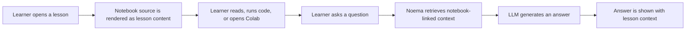
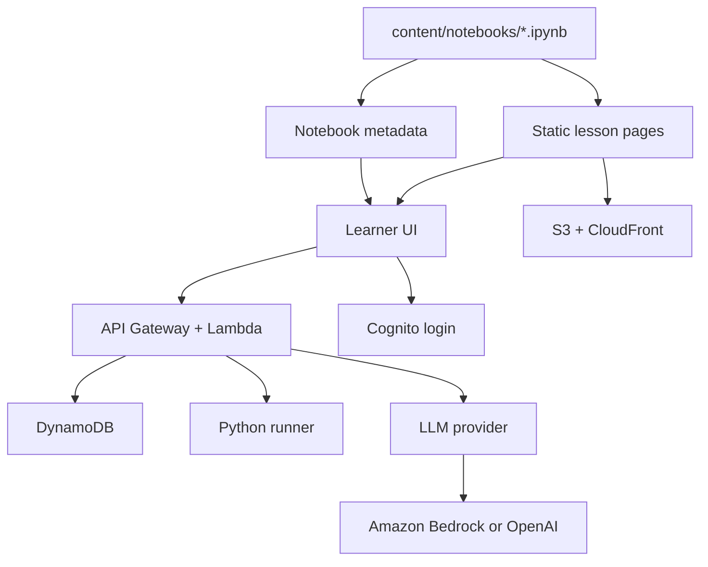
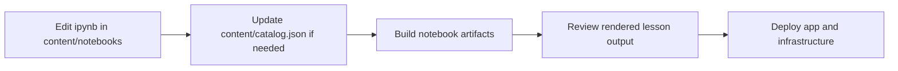

# Noema

Noema is a learning platform for beginners studying machine learning, LLMs, reinforcement learning, and world models.

It combines three things in one place:

- notebook-based course materials
- in-context question answering tied to each lesson
- browser-based Python execution for lightweight experimentation

## What Noema Does

- Serves lesson content from Jupyter notebooks
- Lets learners open the same material in Colab
- Answers questions with notebook-aware context
- Runs Python snippets without requiring local setup
- Keeps infrastructure mostly serverless to reduce operating cost

## Learning Flow



## System Overview



## Repository Structure

- `content/notebooks`: lesson source notebooks
- `content/catalog.json`: lesson catalog and ordering
- `public`: generated public assets
- `src`: app shell and shared logic
- `infra`: AWS CDK infrastructure
- `docs`: architecture and operations notes

## For Learners

The repository is public because the curriculum itself is part of the product.  
The source of truth for lessons lives in `content/notebooks`, and the platform is built around keeping those notebooks easy to inspect, improve, and reuse.

## For Contributors

### Content Pipeline



### Local Development

```bash
npm install
cp .env.example .env
npm run dev
```

Useful commands:

- `npm run build`
- `npm run build:notebooks`
- `npm run typecheck`
- `python3 scripts/check-notebook-code.py`

If you need AWS infrastructure details, see `infra/README.md`.  
If you need deeper system notes, see:

- `docs/system-architecture.md`
- `docs/operations/aws-setup.md`
- `docs/operations/dev-loop.md`
- `docs/operations/runbook.md`
