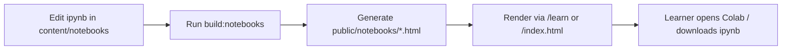
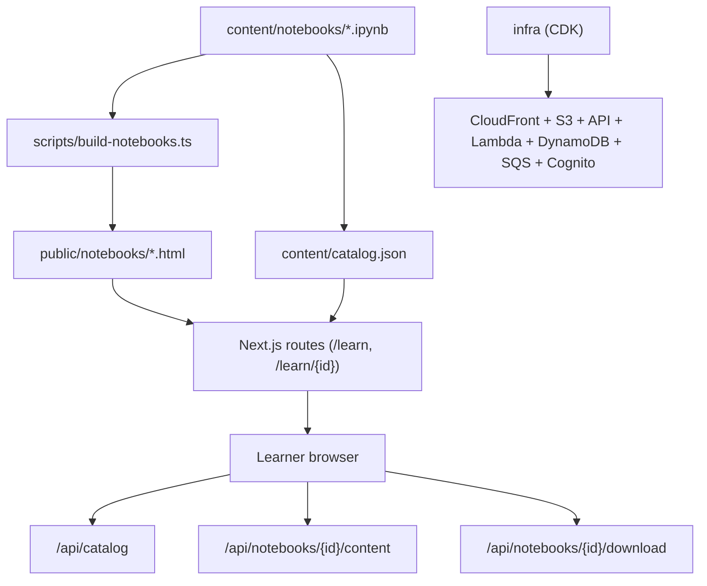
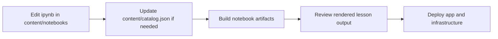

# Noema

Noema is a notebook-first learning platform for Python, machine learning, deep learning, LLMs, reinforcement learning, and world models.

This repository currently contains:

- notebook source content (`content/notebooks`)
- assessment source content (`content/assessments`)
- a Next.js site for landing/list/detail pages (`src/app`)
- a static learning app shell (`public/index.html`)
- build/deploy scripts and AWS CDK infrastructure (`scripts`, `infra`)

## What Noema Does

- Serves lesson content from Jupyter notebooks
- Serves notebook checks and chapter-final assessments from JSON content
- Generates SEO-friendly lesson detail pages
- Lets learners open the same material in Colab
- Provides notebook download/content APIs for the app shell
- Persists learner progress and chapter-final answer drafts in browser storage
- Keeps infrastructure mostly serverless to reduce operating cost

## Learning Flow



## System Overview



## Repository Structure

- `content/notebooks`: lesson source notebooks
- `content/assessments`: notebook checks and chapter-final definitions
- `content/catalog.json`: lesson catalog and ordering
- `public`: generated public assets
- `src`: app shell and shared logic
- `infra`: AWS CDK infrastructure
- `docs`: architecture/operations/spec docs (`docs/README.md`)

## For Learners

The repository is public because the curriculum itself is part of the product.  
The source of truth for lessons lives in `content/notebooks`, and the platform is built around keeping those notebooks easy to inspect, improve, and reuse.

## For Contributors

### Content Pipeline



### Local Development

```bash
npm install
cp .env.example .env
npm run dev
```

Useful commands:

- `npm run build`
- `npm run build:notebooks`
- `npm run typecheck`
- `npm run check:notebook-code`
- `npm run check:notebook-isolated-run`
- `npm run check:python-runtime-safety`

## Documentation

Start from:

- `docs/README.md`

Frequently used docs:

- `docs/system-architecture.md`
- `docs/openapi.yaml`
- `docs/operations/aws-setup.md`
- `docs/operations/dev-loop.md`
- `docs/operations/runbook.md`

For AWS infrastructure details, see `infra/README.md`.
