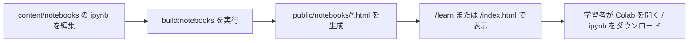
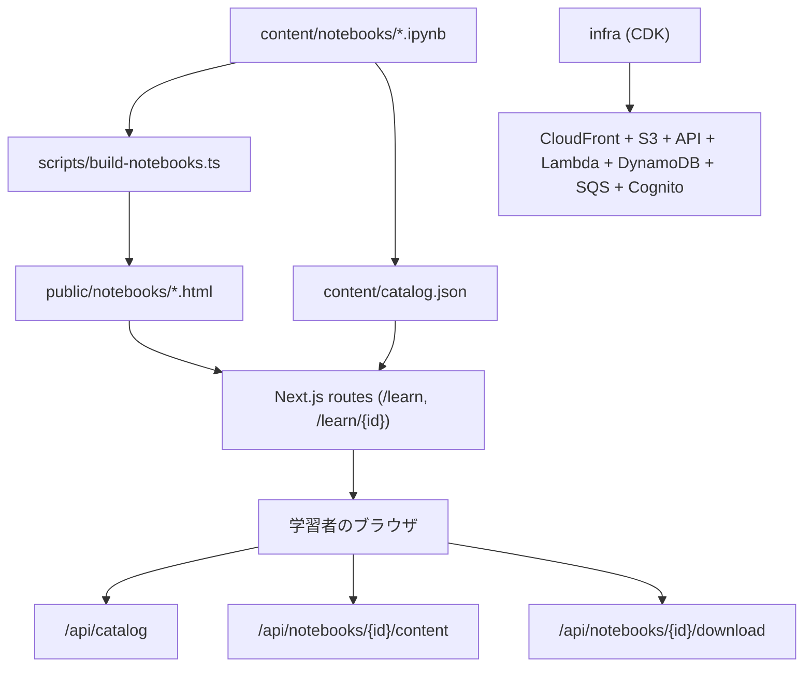
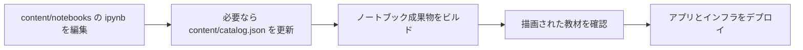

# Noema

Noema は、Python、機械学習、深層学習、LLM、強化学習、世界モデルをノートブック中心で学ぶための学習プラットフォームです。

このリポジトリには、現在次の要素が含まれています。

- 教材ノートブックのソース（`content/notebooks`）
- 確認問題・章末課題のソース（`content/assessments`）
- ランディング、一覧、詳細ページを提供する Next.js サイト（`src/app`）
- 静的な学習アプリのシェル（`public/index.html`）
- ビルド・デプロイスクリプトと AWS CDK インフラ（`scripts`, `infra`）

## 環境 URL

- `development`: `https://d8mpxq2nx10ai.cloudfront.net/`

注意:

- この URL は秘密情報ではありません。公開ドキュメントに記載して問題ありません。
- アクセス制御は URL が非公開であることに依存してはいけません。
- 現在のフロントエンド URL の正は GitHub Environment 変数 `NOEMA_FRONTEND_URL` です。

## Noema が提供すること

- Jupyter Notebook から作成した教材を配信する
- JSON で管理された notebook check と chapter final を配信する
- SEO に向いた教材詳細ページを生成する
- 同じ教材を Colab で開けるようにする
- 学習アプリ向けにノートブックのダウンロード API と本文 API を提供する
- 学習進捗と章末課題の下書きをブラウザストレージに保存する
- 運用コストを抑えるため、インフラはできるだけサーバーレスに保つ

## 学習コンテンツの流れ


```mermaid
flowchart LR
  A["content/notebooks の ipynb を編集"] --> B["build:notebooks を実行"]
  B --> C["public/notebooks/*.html を生成"]
  C --> D["/learn または /index.html で表示"]
  D --> E["学習者が Colab を開く / ipynb をダウンロード"]
```

## システム概要


```mermaid
flowchart TD
  A["content/notebooks/*.ipynb"] --> B["scripts/build-notebooks.ts"]
  B --> C["public/notebooks/*.html"]
  A --> D["content/catalog.json"]
  D --> E["Next.js routes (/learn, /learn/{id})"]
  C --> E
  E --> F["学習者のブラウザ"]
  F --> G["/api/catalog"]
  F --> H["/api/notebooks/{id}/content"]
  F --> I["/api/notebooks/{id}/download"]
  J["infra (CDK)"] --> K["CloudFront + S3 + API + Lambda + DynamoDB + SQS + Cognito"]
```

## リポジトリ構成

- `content/notebooks`: 教材ノートブックのソース
- `content/assessments`: notebook check と chapter final の定義
- `content/catalog.json`: 教材カタログと表示順
- `public`: 生成済みの公開アセット
- `src`: アプリシェルと共有ロジック
- `infra`: AWS CDK インフラ
- `docs`: アーキテクチャ、運用、仕様のドキュメント（`docs/README.md`）

## 学習者向け

このリポジトリは、カリキュラム自体がプロダクトの一部であるため公開されています。教材の正は `content/notebooks` にあり、教材を確認し、改善し、再利用しやすい状態に保つことを前提に設計しています。

## コントリビューター向け

### コンテンツパイプライン


```mermaid
flowchart LR
  A["content/notebooks の ipynb を編集"] --> B["必要なら content/catalog.json を更新"]
  B --> C["ノートブック成果物をビルド"]
  C --> D["描画された教材を確認"]
  D --> E["アプリとインフラをデプロイ"]
```

### ローカル開発

```bash
npm install
cp .env.example .env
npm run dev
```

よく使うコマンド:

- `npm run build`
- `npm run build:notebooks`
- `npm run typecheck`
- `npm run check:notebook-code`
- `npm run check:notebook-isolated-run`
- `npm run check:python-runtime-safety`

## ドキュメント

まず読むもの:

- `docs/README.md`

よく使うドキュメント:

- `docs/system-architecture.md`
- `docs/openapi.yaml`
- `docs/operations/aws-setup.md`
- `docs/operations/dev-loop.md`
- `docs/operations/runbook.md`

AWS インフラの詳細は `infra/README.md` を参照してください。
