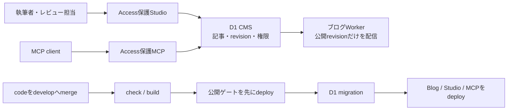

# Noema

Noemaは、AIでできることと、その仕組みを、直感と具体例からひもとく独立した技術メディアです。公開ブログ、複数人で編集・レビュー・公開できるCMS型Studio、表示中の記事だけを文脈に質問できるLLMアシスタントをCloudflare上で開発しています。

旧notebook学習サービスとAWS実装は退役済みです。コード、教材、AWS CDK、復元手順、退役記録は [Noema AWS Archive](https://github.com/mani1261790/Noema-AWS-Archive) に保存しています。

## 現在の利用先

| 対象 | URL | 状態 |
| --- | --- | --- |
| ブログ | <https://noema-learn.mani1261790.workers.dev> | app codeは`develop`からdeploy。記事はD1から実行時に反映 |
| Studio | <https://studio.noema-learn.uk> | Cloudflare AccessとCMS roleで執筆者だけに公開 |
| Studio MCP | <https://mcp.noema-learn.uk/mcp> | Access Managed OAuthとCMS roleで保護する下書き連携endpoint |
| 公開予定domain | <https://noema-learn.uk> | 公開ゲートが404を返すため非公開 |

記事、revision、メンバー権限、レビュー状態、公開範囲の正本はCloudflare D1です。Studioで保存・レビュー・承認・公開すると、ブログWorkerが公開revisionをD1から読み取るため、記事公開ごとのGitHub Pull Requestや再デプロイは不要です。GitHubはcode、D1 migration、docs、必要に応じたbackupを管理します。画像はprivateなCloudflare R2へ保存する設計ですが、現在はaccountでR2が未有効のためStudioからuploadできません。

- 記事を新規作成・再編集し、レビュー・公開する: [記事が反映されるまで](docs/studio-blog-connectivity.md#記事が反映されるまで)
- メンバーを追加する: [メンバーを招待する](docs/studio-blog-connectivity.md#メンバーを招待する)
- 公開範囲やURL、旧Studio URLを確認する: [Studio・CMS・ブログ接続ガイド](docs/studio-blog-connectivity.md)
- MCP clientから下書きを読み書きする: [Studio MCP運用ガイド](docs/studio-mcp.md)

`develop`へのmergeでのみCloudflare deploymentが動きます。`main`へのpushではdeployしません。手動実行も`develop`以外ではjobを開始しません。


```mermaid
flowchart LR
  Author["執筆者・レビュー担当"] --> Studio["Access保護Studio"]
  McpClient["MCP client"] --> Mcp["Access保護MCP"]
  Studio --> D1["D1 CMS<br/>記事・revision・権限"]
  Mcp --> D1
  D1 --> Blog["ブログWorker<br/>公開revisionだけを配信"]
  Develop["codeをdevelopへmerge"] --> CI["check / build"]
  CI --> Gate["公開ゲートを先にdeploy"]
  Gate --> Migration["D1 migration"]
  Migration --> Deploy["Blog / Studio / MCPをdeploy"]
```

## リポジトリ構成

- `vnext/apps/blog`: Astroによるブログと記事アシスタントAPI
- `vnext/apps/studio`: React/ViteによるMarkdown執筆Studio
- `vnext/apps/studio-mcp`: Studioの下書き操作だけを公開するremote MCP Worker
- `vnext/apps/public-gate`: `noema-learn.uk`を非公開に保つWorker
- `vnext/packages/content`: 記事schema、Markdown出力、UI確認用fixture
- `vnext/packages/cms`: CMSのrole、review・publication状態、公開範囲、API contract
- `vnext/packages/ui`: 共通UIとデジタル庁デザインシステム準拠style
- `docs`: product仕様、開発deploy手順、UIガイド、公式design reference

## ローカル開発

Node.js 22.18以上が必要です。GitHub ActionsはNode.js 24を使います。

```bash
cd vnext
npm ci
npm run dev:blog
```

`dev:blog`は起動前にStudioのmigrationをBlog用local D1へ適用し、Cloudflare adapter経由で`CMS_DB`を利用します。Remote D1は変更しません。

Studioは別terminalで起動します。

```bash
cd vnext
npm run dev:studio
```

既定URLはブログが `http://localhost:4321`、Studioが `http://localhost:4322` です。

StudioのCMS APIとlocal D1まで確認する場合は、[アプリケーションREADME](vnext/README.md#studio)のWorker開発手順を使用します。

## 検証

```bash
cd vnext
npm run check
npm run build
npm run deploy:dry-run
```

`deploy:dry-run`はCloudflareへuploadせず、公開ゲート、ブログ、Studio、Studio MCPのbundleを検証します。

## デプロイと運用

- workflow: `.github/workflows/deploy-development.yml`
- trigger: `develop`へのpushのうち、`vnext/**`またはworkflow自体が変わった場合
- Secret: repository secret `CLOUDFLARE_API_TOKEN`
- order: test・check・build、公開ゲート、D1 migration、ブログ、Studio、Studio MCP
- concurrency: 新しいdeployを優先し、進行中の古いdevelop deployはcancel
- GitHub Deploymentsは使わず、実行結果はActionsとCloudflare Workersのversion履歴で確認

詳しい初期設定、確認方法、rollbackは [開発環境デプロイ](docs/development-deployment.md) を参照してください。

## ドキュメント

- [ドキュメント案内](docs/README.md)
- [Studio・CMS・ブログ接続ガイド](docs/studio-blog-connectivity.md): 記事の編集・レビュー・公開・メンバー管理
- [Studio MCP運用ガイド](docs/studio-mcp.md): remote MCPの認証、tool境界、導入・確認手順
- [CMS contract](vnext/packages/cms/README.md)
- [プロダクト再設計仕様](docs/product-reboot.md)
- [コンテンツ・掲載方針](docs/content-strategy.md)
- [開発環境デプロイ](docs/development-deployment.md)
- [Noema UIスタイルガイド](docs/noema-style-guide.md)
- [デジタル庁デザインシステム固定リファレンス](docs/references/digital-agency-design-system/README.md)
- [デザイン適合表](vnext/DESIGN_CONFORMANCE.md)
