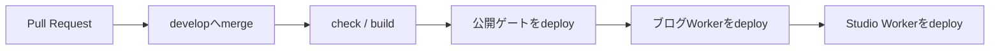

# Noema

Noemaは、専門的な技術を非技術者にも分かる形で届けるMarkdown技術ブログです。公開ブログ、Markdown執筆用Studio、表示中の記事だけを文脈に質問できるLLMアシスタントをCloudflare Workers上で開発しています。

旧notebook学習サービスとAWS実装は退役済みです。コード、教材、AWS CDK、復元手順、退役記録は [Noema AWS Archive](https://github.com/mani1261790/Noema-AWS-Archive) に保存しています。

## 開発環境

| 対象 | URL | 状態 |
| --- | --- | --- |
| ブログ | <https://noema-learn.mani1261790.workers.dev> | `develop`の最新versionを自動deploy |
| Studio | <https://noema-studio.mani1261790.workers.dev> | `develop`の最新versionを自動deploy |
| 公開予定domain | <https://noema-learn.uk> | 公開ゲートが404を返すため非公開 |

`develop`へのmergeでのみCloudflare deploymentが動きます。`main`へのpushではdeployしません。手動実行も`develop`以外ではjobを開始しません。


```mermaid
flowchart LR
  PR["Pull Request"] --> Develop["developへmerge"]
  Develop --> CI["check / build"]
  CI --> Gate["公開ゲートをdeploy"]
  Gate --> Blog["ブログWorkerをdeploy"]
  Blog --> Studio["Studio Workerをdeploy"]
```

## リポジトリ構成

- `vnext/apps/blog`: Astroによるブログと記事アシスタントAPI
- `vnext/apps/studio`: React/ViteによるMarkdown執筆Studio
- `vnext/apps/public-gate`: `noema-learn.uk`を非公開に保つWorker
- `vnext/packages/content`: 記事schema、Markdown出力、UI確認用fixture
- `vnext/packages/ui`: 共通UIとデジタル庁デザインシステム準拠style
- `docs`: product仕様、開発deploy手順、UIガイド、公式design reference

## ローカル開発

Node.js 22.18以上が必要です。GitHub ActionsはNode.js 24を使います。

```bash
cd vnext
npm ci
npm run dev:blog
```

Studioは別terminalで起動します。

```bash
cd vnext
npm run dev:studio
```

既定URLはブログが `http://localhost:4321`、Studioが `http://localhost:4322` です。

## 検証

```bash
cd vnext
npm run check
npm run build
npm run deploy:dry-run
```

`deploy:dry-run`はCloudflareへuploadせず、公開ゲート、ブログ、Studioのbundleを検証します。

## デプロイと運用

- workflow: `.github/workflows/deploy-development.yml`
- trigger: `develop`へのpushのうち、`vnext/**`またはworkflow自体が変わった場合
- GitHub Environment: `development`（deploy可能branchを`develop`に限定）
- Secret: repository secret `CLOUDFLARE_API_TOKEN`
- concurrency: 新しいdeployを優先し、進行中の古いdevelop deployはcancel

詳しい初期設定、確認方法、rollbackは [開発環境デプロイ](docs/development-deployment.md) を参照してください。

## ドキュメント

- [ドキュメント案内](docs/README.md)
- [プロダクト再設計仕様](docs/product-reboot.md)
- [開発環境デプロイ](docs/development-deployment.md)
- [Noema UIスタイルガイド](docs/noema-style-guide.md)
- [デジタル庁デザインシステム固定リファレンス](docs/references/digital-agency-design-system/README.md)
- [デザイン適合表](vnext/DESIGN_CONFORMANCE.md)
