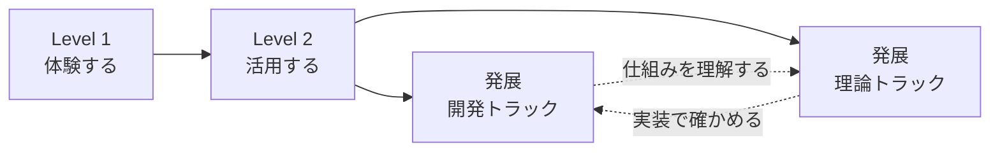

# Noemaコンテンツ・学習導線仕様

ステータス: 決定済み・現行実装基準

決定日: 2026-07-11

## 1. 目的

Noemaは、AIを使う最初の体験から、開発と理論の深い理解までを支える独立した教材サービスである。収益化を目的にせず、読者が自分で次の学びを選べる状態をつくる。

運営背景にはOIFがあるが、NoemaをOIFの勧誘サイトとして設計しない。良質な教材として信頼された結果、運営者に関心を持った読者がOIFを知る自然な流れを採用する。

## 2. 想定読者

### 入口層

- AIに関心はあるが、使いどころが分からない人
- 数式、コード、Terminalから始めると挫折しやすい人
- まず目に見える成果をつくり、AIの有用性を体験したい人

### 深化層

- AIを使うだけでなく、自分で仕組みをつくりたい人
- LLM、拡散モデル、機械学習等が動く理由を理解したい人
- 開発と理論の一方、または両方を継続的に学びたい人

## 3. 学習構造



| 段階・トラック | 対象 | 出口 |
| --- | --- | --- |
| Level 1・体験する | AI未経験者 | AIで目に見える成果を一つ得る |
| Level 2・活用する | 体験を日常や制作へ広げたい人 | 自分の目的に合わせてAIを使う |
| 開発トラック | 自分で仕組みをつくりたい人 | Terminal、Git、Web、DB、Cloudを使って実装する |
| 理論トラック | AIが動く理由を知りたい人 | LLM、機械学習、統計等を直感から理解する |

Level 2のCodex記事は非開発者向け体験までとし、TerminalやGitを前提にしない。本格的な環境構築と実装は開発トラックで扱う。

開発と理論は上下関係ではなく同格の発展トラックである。両方を学ぶ読者には開発から理論へ進む順序を推奨するが、必須順序にはしない。

## 4. テーマとタグ

テーマは長期的に変わりにくい目的別分類とする。

1. AIを使う
2. AIとつくる
3. 知識と作業環境
4. 開発の基礎
5. AIの仕組み
6. 数理と理論

ChatGPT、NotebookLM、Codex、Obsidian、Python、Cloudflare等の製品名・技術名はタグとして管理する。ツールの流行や名称変更によってサイトの主要分類が崩れないようにする。

## 5. 記事メタデータ

```yaml
stage: "experience" # experience | practice | advanced
track: "common" # common | development | theory
outcome: "この記事を読んだ後にできること"
prerequisites: []
topics:
  - "ai-tools"
tags:
  - "NotebookLM"
```

- `experience`と`practice`は`track: common`だけを許可する。
- `advanced`は`development`または`theory`を必須とする。
- レベルは文章の難しさではなく、読むために必要な前提知識で決める。
- 記事カードと記事冒頭に段階、トラック、読了時間、到達点を表示する。
- 前提知識がある場合は、記事本文より前に明示する。

## 6. 自走を支える導線

- トップページではテーマより先に学習段階と発展トラックを示す。
- 記事一覧は学習段階、発展トラック、テーマ、キーワードで絞り込めるようにする。
- 各記事には同じトラックを続ける関連記事と、もう一方の視点へ進む関連記事を将来追加する。
- 体系全体の完成を待たず、「読者がすごいと感じやすい体験」から記事を公開し、後から関連記事でつなぐ。

## 7. NoemaとOIFの関係

- Noemaの名称、編集方針、学習体験を最優先する。
- ヘッダー、記事カード、記事末尾、学習トラックにOIFの勧誘CTAを置かない。
- OIFへのリンクはNoemaのAboutページ内の運営情報から`https://oif-ai.com`へ張る。
- フッターは「運営について」からAboutページへ案内し、OIF名を前面に出さない。
- 記事分類をOIFの組織構成として説明しない。

## 8. 受入条件

- 旧テンプレートの人工知能、データサイエンス、ネットワーク、ハードウェア等の固定分類が現行UIに残っていない。
- Level 1・2と開発・理論の並列関係が、色だけに依存せず見出しと文章で理解できる。
- CodexのLevel 2記事がTerminalやGitを前提にしていない。
- 記事スキーマ、Studio、記事一覧、記事ページで同じ段階・トラック定義を使う。
- OIFへの外部リンクはAboutページだけにあり、Noemaの主要導線を妨げない。
- 公開記事が0件でも、学習構造と今後の方向性を理解できる。
