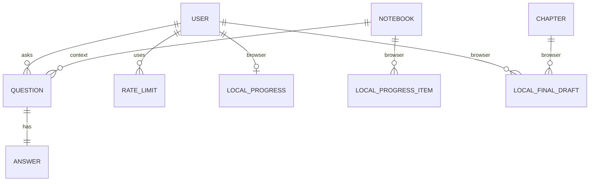
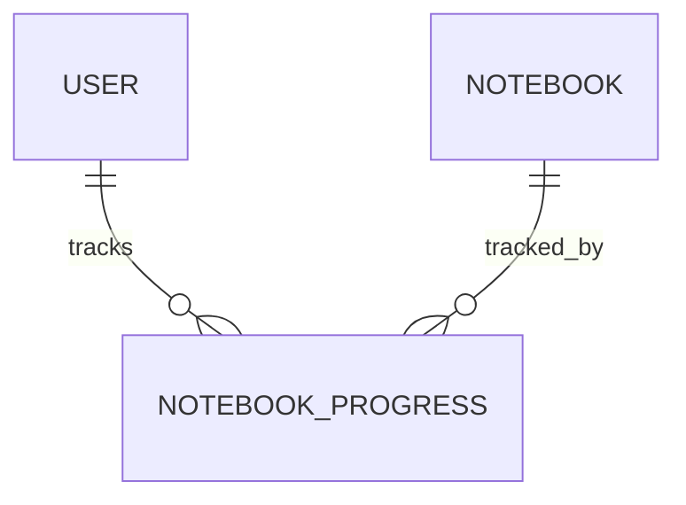

# Noema Data Model (Current + Migration)

This document reflects the real implementation and the next migration step.

## Current situation

Data is split across:

Cognito
identity

DynamoDB
questions, answers, rate limits

S3
notebook html

localStorage
progress, playground drafts, chapter-final answer drafts, api keys

## Current ER diagram

## Target

Move only progress to AWS

## Table design

PK userId
SK NOTEBOOK#<id>

Fields
visits
completed
completedAt

## Migration

1 read localStorage
2 send to API
3 store in DynamoDB
4 switch reads
