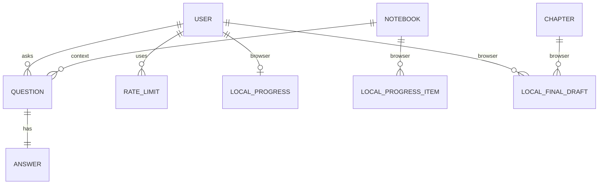
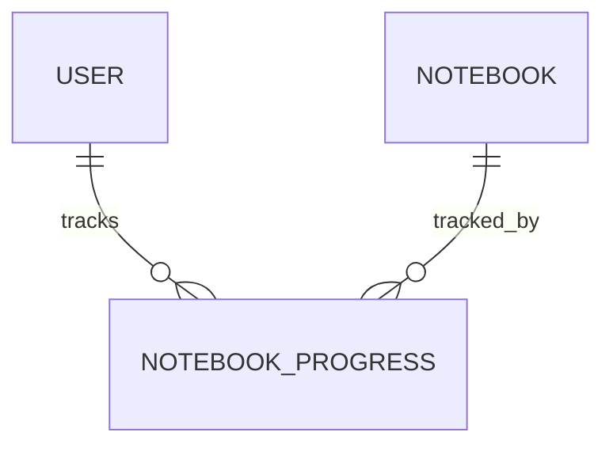

# Noema データモデル（現状 + 移行）

このドキュメントは、現在の実装と次の移行ステップを整理します。

## 現状

データは次の場所に分かれています。

Cognito
identity

DynamoDB
questions, answers, rate limits（質問、回答、レート制限）

S3
notebook html

localStorage
progress, playground drafts, chapter-final answer drafts, api keys（進捗、playground 下書き、chapter final 下書き、API key）

## 現在の ER 図

```mermaid
erDiagram
  USER ||--o{ QUESTION : asks
  QUESTION ||--|| ANSWER : has
  USER ||--o{ RATE_LIMIT : uses
  NOTEBOOK ||--o{ QUESTION : context

  USER ||--o| LOCAL_PROGRESS : browser
  NOTEBOOK ||--o{ LOCAL_PROGRESS_ITEM : browser
  USER ||--o{ LOCAL_FINAL_DRAFT : browser
  CHAPTER ||--o{ LOCAL_FINAL_DRAFT : browser
```

## 目標

学習進捗だけを AWS へ移します。

```mermaid
erDiagram
  USER ||--o{ NOTEBOOK_PROGRESS : tracks
  NOTEBOOK ||--o{ NOTEBOOK_PROGRESS : tracked_by
```

## テーブル設計

PK userId
SK NOTEBOOK#<id>

フィールド:

visits
completed
completedAt

## 移行手順

1. localStorage を読む
2. API に送る
3. DynamoDB に保存する
4. 読み取り元を切り替える
