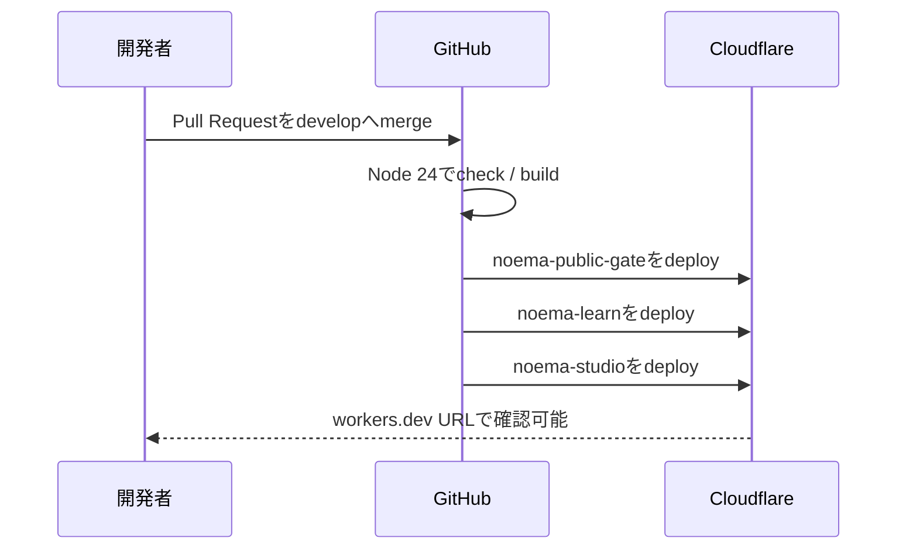

# 開発環境デプロイ

この文書は、現行NoemaをCloudflare上で確認しながら開発するためのbranch、GitHub Actions、URL、rollbackの正を定めます。

## デプロイ方針

- 自動デプロイ元は `develop` だけです。
- `main`、feature branch、Pull Requestからはデプロイしません。
- 手動実行も `develop` ref以外ではjobをskipします。
- GitHub Deployments / Environmentsは使いません。branch triggerとjob条件の両方で`develop`だけに制限します。
- 連続してmergeされた場合は、古い実行をcancelして最新の`develop`を優先します。
- `noema-learn.uk`は公開承認まで公開ゲートで404を返します。

GitHub Actionsの正は `.github/workflows/deploy-development.yml` です。

## 確認URL

| 対象 | Worker | URL |
| --- | --- | --- |
| ブログ | `noema-learn` | <https://noema-learn.mani1261790.workers.dev> |
| Studio | `noema-studio` | <https://noema-studio.mani1261790.workers.dev> |
| 公開ゲート | `noema-public-gate` | <https://noema-learn.uk>（期待値404） |

ブログとStudioの`workers.dev` URLには、最後に成功した`develop`のCloudflare Worker versionが表示されます。公開ゲートは本番hostnameへのrouteだけを持ち、ブログWorkerは本番routeを持ちません。

## 自動デプロイの流れ



公開ゲートを最初にdeployするため、後続Workerの更新中も`noema-learn.uk`が開くことはありません。

## GitHub設定

### Repository Secret

- `CLOUDFLARE_API_TOKEN`

Token値をIssue、Pull Request、ログ、チャットへ貼らないでください。確認は名前だけを表示します。

```bash
gh secret list --repo mani1261790/Noema
```

Tokenを更新する場合:

```bash
gh secret set CLOUDFLARE_API_TOKEN --repo mani1261790/Noema
```

Cloudflare側では対象accountのWorkers編集と、`noema-learn.uk` zoneのWorker Route編集に必要な最小権限へ限定します。

GitHub Environmentは作成しません。Secretはrepository levelだけに置き、GitHub Deploymentsの履歴も生成しません。

## 変更を確認する手順

1. feature branchで実装し、`npm run check`、`npm run build`、`npm run deploy:dry-run`を実行
2. Pull Requestを`develop`へmerge
3. Actionsの`Deploy Noema development preview to Cloudflare`が成功するまで待つ
4. ブログとStudioの`workers.dev` URLを確認
5. `noema-learn.uk`が404、`Cache-Control: no-store`、`X-Robots-Tag: noindex`のままであることを確認

```bash
curl -I https://noema-learn.mani1261790.workers.dev/
curl -I https://noema-studio.mani1261790.workers.dev/
curl -I https://noema-learn.uk/
```

## 手動デプロイ

通常はGitHub Actionsを使います。障害調査でローカル実行が必要な場合だけ、Cloudflareへloginして同じ順序で実行します。

```bash
cd vnext
npx wrangler login
npx wrangler whoami
npm ci
npm run check
npm run deploy:dry-run
npm run deploy:gate
VITE_PUBLIC_SITE_URL=https://noema-learn.mani1261790.workers.dev npm run deploy:blog
VITE_PUBLIC_SITE_URL=https://noema-learn.mani1261790.workers.dev npm run deploy:studio
```

手動実行後も、正となるcommitを`develop`へmergeしてActionsの実行履歴とCloudflare上のversionを一致させます。

## Rollback

1. Cloudflare Dashboardで直接コードを編集しません。
2. 原因commitをrevertするPull Requestを`develop`へ作成します。
3. merge後の自動デプロイで3 Workerを揃えて戻します。
4. 緊急時はCloudflareのWorker deployment履歴から直前versionへrollbackし、その後必ず`develop`もrevertします。

公開ゲートに問題がある場合は、ブログより先に`noema-public-gate`を安全なversionへ戻します。

## 公開への切り替え

このworkflowは開発preview専用です。`noema-learn.uk`を公開する変更は、次をまとめた別の承認済みPull Requestで行います。

- 公開ゲートからWorker Routeを外す
- ブログWorkerへcustom domainまたはrouteを設定する
- production用workflowを新設する
- SEO、security、mobile、LLM assistantの受入確認を行う

`develop`向けworkflowをそのまま本番公開workflowへ転用しません。
