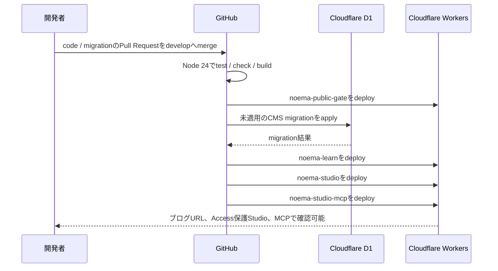

# 開発環境デプロイ

この文書は、現行NoemaをCloudflare上で確認しながら開発するためのbranch、GitHub Actions、D1 migration、URL、rollbackの正を定めます。

## デプロイ方針

- 自動デプロイ元は `develop` だけです。
- `main`、feature branch、Pull Requestからはデプロイしません。
- 手動実行も `develop` ref以外ではjobをskipします。
- GitHub Deployments / Environmentsは使いません。branch triggerとjob条件の両方で`develop`だけに制限します。
- 連続してmergeされた場合は、古い実行をcancelして最新の`develop`を優先します。
- `noema-learn.uk`は公開承認まで公開ゲートで404を返します。
- 記事の保存、レビュー、公開はD1 CMS内で完結し、記事公開ごとのcode deployは行いません。
- Path filterは変更内容ではなくfile pathで判定します。`vnext/**`配下のREADME等も対象になるため、runtime codeが変わっていなくてもworkflowは起動します。

GitHub Actionsの正は `.github/workflows/deploy-development.yml` です。

## 確認URLとデータ

| 対象 | Worker / resource | URL・役割 |
| --- | --- | --- |
| ブログ | `noema-learn` | <https://noema-learn.mani1261790.workers.dev> |
| Studio | `noema-studio` | <https://studio.noema-learn.uk>（Cloudflare Access保護） |
| Studio MCP | `noema-studio-mcp` | <https://mcp.noema-learn.uk/mcp>（Access Managed OAuth保護） |
| 公開ゲート | `noema-public-gate` | <https://noema-learn.uk>（期待値404） |
| CMS database | D1 `noema-cms` | 記事、revision、role、review、公開範囲の正本 |
| 記事画像 | R2 | accountで未有効のためupload不可 |
| Discord通知 | Queue `noema-studio-discord-milestones` | 記事作成、レビュー依頼、公開成功の3イベントだけを非同期配送 |

ブログの`workers.dev` URL、StudioとStudio MCPのcustom domainには、最後に成功した`develop`のCloudflare Worker versionが表示されます。記事本文はD1から実行時に読み取るため、同じWorker versionのままでもCMSの公開操作によって内容が変わります。

Studioの`workers.dev`とpreview URLは認証の迂回経路を残さないため無効です。旧URLを開いた際の「There is nothing here yet」は閉鎖済み入口の汎用表示であり、Studioはcustom domainを使用します。

ブログにはUI確認用の記事fixtureもありますが、fixtureは開発previewだけのもので、CMSの本番記事ではありません。公開ゲートは本番hostnameへのrouteだけを持ち、ブログWorkerは本番routeを持ちません。Studioからブログへの記事反映は[Studio・CMS・ブログ接続ガイド](./studio-blog-connectivity.md)を参照してください。

## 自動デプロイの流れ



公開ゲートを最初にdeployするため、後続処理中も`noema-learn.uk`が開くことはありません。D1 migrationに失敗した場合はBlog、Studio、Studio MCPをdeployせず停止します。

Migrationは旧Workerと新Workerの両方から安全に参照できるforward-compatibleな変更にします。workflowがmigration適用後にcancelまたは失敗しても旧Workerが動くよう、列やtableの追加と利用開始を分け、削除・rename等は別のmigrationへ段階化します。

## GitHub設定

### Repository Secret

- `CLOUDFLARE_API_TOKEN`

Token値をIssue、Pull Request、ログ、チャットへ貼らないでください。確認は名前だけを表示します。

Studio MCPはこれとは別に、Access applicationのAUDをWranglerの通常変数`MCP_ACCESS_POLICY_AUD`として必要とします。秘密情報ではありません。初回設定は[Studio MCP接続・運用ガイド](./studio-mcp.md#cloudflare初期設定)に従い、AUDを`vnext/apps/studio-mcp/wrangler.jsonc`の`vars`へ設定します。

```bash
gh secret list --repo mani1261790/Noema
```

Tokenを更新する場合:

```bash
gh secret set CLOUDFLARE_API_TOKEN --repo mani1261790/Noema
```

Cloudflare側では対象accountとzoneへ限定し、少なくとも次の操作に必要な権限を付与します。

- Account: Workers Scriptsの編集
- Account: D1の編集
- Account: Queuesの編集
- Zone `noema-learn.uk`: Workers Routeの編集

R2 bucketはaccountで未有効です。R2の有効化、bucket作成、billingに関わる操作はdeploy workflowへ追加せず、明示承認後に一度だけ行います。

GitHub Environmentは作成しません。Secretはrepository levelだけに置き、GitHub Deploymentsの履歴も生成しません。

### GitHub ActionsでWranglerが失敗する

WorkflowはNode.js 24とWrangler 4.110.0を固定しています。ログにNode.js 20の廃止警告が出ても、`ACTIONS_ALLOW_USE_UNSECURE_NODE_VERSION=true`は設定せず、Wrangler step末尾の最初の`ERROR`とcodeを確認します。

D1 migrationで次のcodeが出る場合は、Worker codeではなくAPI tokenの権限または対象accountを確認します。

```text
The given account is not valid or is not authorized to access this service [code: 7403]
```

1. Cloudflare Dashboardでtokenのresource scopeがNoemaのaccountと`noema-learn.uk` zoneを指していることを確認します。
2. Accountの`Workers Scripts: Edit`と`D1: Edit`、対象zoneの`Workers Routes: Edit`を確認します。
3. tokenを更新または再作成した場合は、repository secret `CLOUDFLARE_API_TOKEN`を更新します。
4. Secret値をログへ出さず、失敗したworkflowを`develop` refで再実行します。

`gh secret list`で確認できるのはSecret名と更新日時だけです。Cloudflare側の権限はCloudflare Dashboardで確認します。Migration stepが成功するまで、後続のBlog・Studio・Studio MCP deployは実行されません。

## D1 migration

Migration fileの正は `vnext/apps/studio/migrations`、database名は`noema-cms`です。Studioの`wrangler.jsonc`だけがmigration directoryを定義し、Blogのconfigは同じdatabaseへの読取bindingだけを持ちます。

未適用migrationを確認します。

```bash
cd vnext
npx wrangler d1 migrations list noema-cms \
  --remote \
  --config apps/studio/wrangler.jsonc
```

障害調査で手動applyが必要な場合だけ、対象accountを`wrangler whoami`で確認してから実行します。

```bash
cd vnext
npx wrangler whoami
npx wrangler d1 migrations apply noema-cms \
  --remote \
  --config apps/studio/wrangler.jsonc
```

Migrationの適用履歴はD1の`d1_migrations` tableでWranglerが管理します。このtableを手作業で変更したり、適用済みfileを書き換えたりしません。schemaを戻す必要がある場合も、適用履歴を削除せず新しいforward migrationを作成します。

## Discord節目通知の初期設定

Discordへ送るのは、記事とrevision 1の作成、レビュー依頼、公開成功の3イベントだけです。revision 2以降、保存、画像操作、コメント、承認、アーカイブ、日次ダイジェストは送信しません。

通知はD1のoutboxへCMS更新と同時に記録し、Queue consumerからDiscord Webhookへ配送します。StudioとStudio MCPは同じQueueのproducerであり、Webhook URLを持つのはStudio Workerだけです。

初回deploy前にQueueとdead-letter Queueを作成します。既存resourceを作り直さず、`wrangler queues list`で名前を確認してから不足分だけ作成します。

```bash
cd vnext
npx wrangler queues list
npx wrangler queues create noema-studio-discord-milestones
npx wrangler queues create noema-studio-discord-milestones-dlq
```

専用の検証チャンネルでDiscord Webhookを作成し、値をログやIssueへ貼らずStudio Worker Secretへ設定します。Studio MCPへ同じSecretを設定する必要はありません。

```bash
cd vnext
npx wrangler secret put DISCORD_WEBHOOK_URL \
  --config apps/studio/wrangler.jsonc
```

QueueとSecretが揃う前にこの機能を含むPRをmergeしません。初回の実疎通では検証用記事を1件作成し、限定記事の題名、メールアドレス、本文、レビューコメントがDiscord payloadへ含まれないことを確認します。

### D1 backupの現在地

現在のworkflowはD1の記事を自動exportしません。GitHubにはcodeとmigrationが保存されますが、D1の最新記事本文が自動で複製されるわけではありません。「必要に応じたbackup」は、別途承認したexportを保存する場合を指します。

本番公開前に、export頻度、保存先、retention、暗号化、復元testを決めます。それまではGitHubを記事データの最新backupとは扱いません。

## ローカルCMS開発

Blogの`predev`は、ローカルD1へ未適用migrationを適用してからAstroを起動します。AstroのCloudflare adapterを開発時にも使用するため、通常の`npm run dev:blog`で`cloudflare:workers`のlocal `CMS_DB` bindingを利用できます。

```bash
cd vnext
npm run dev:blog
```

内部ではBlog workspaceを基準に、次のmigration commandと同じ処理を行います。`--persist-to .wrangler/state`をBlogのlocal runtimeと揃えることで、migrationを適用したdatabaseをAstro devから読み取れます。

```bash
cd vnext/apps/blog
npm run cms:migrate:local
```

Studioの画面だけを調整する`npm run dev:studio`はVite dev serverです。Workerのasset配信とlocal D1 bindingを確認する場合は、Studio Workerを起動します。

```bash
cd vnext/apps/studio
npx wrangler d1 migrations apply noema-cms \
  --local \
  --config wrangler.jsonc
npm run dev:worker
```

ローカルで作成した記事はremote D1へ送信されません。remote resourceへ接続する設定を明示的に追加しない限り、Wranglerはlocal storageを使用します。

localhostではCloudflare Access edgeが`Cf-Access-Jwt-Assertion`を付与しないため、通常のbrowserでCMS APIへloginできるわけではありません。APIのAccess認証、role、D1 mutationはlocal Worker testで確認し、Accessを含む画面全体のflowはdeploy後の`studio.noema-learn.uk`で確認します。

## 変更を確認する手順

1. feature branchで実装し、`npm test`、`npm run check`、`npm run build`、`npm run deploy:dry-run`を実行
2. schema変更がある場合はlocal D1へmigrationを適用し、旧codeと新codeの両方で後方互換性を確認
3. Pull Requestを`develop`へmerge
4. Actionsの`Deploy Noema development preview to Cloudflare`が成功するまで待つ
5. D1 migration、公開ゲート、Blog、Studio、Studio MCPの各stepが成功したことを確認
6. ブログの`workers.dev` URLとAccess保護されたStudio custom domainを確認
7. `noema-learn.uk`が404、`Cache-Control: no-store`、`X-Robots-Tag: noindex`のままであることを確認

```bash
curl -I https://noema-learn.mani1261790.workers.dev/
curl -I https://studio.noema-learn.uk/
curl -I https://noema-learn.uk/
```

CMS変更では、一般公開、限定URL、運営メンバー限定、保管の各記事が意図したsurfaceだけに出ることも確認します。指定メンバー公開は読者認証が未接続のため、公開操作が拒否されることを期待値とします。

## 手動デプロイ

通常はGitHub Actionsを使います。障害調査でローカル実行が必要な場合だけ、Cloudflareへloginしてworkflowと同じ順序で実行します。

```bash
cd vnext
npx wrangler login
npx wrangler whoami
npm ci
npm test
npm run check
npm run deploy:dry-run
npm run deploy:gate
npx wrangler d1 migrations apply noema-cms \
  --remote \
  --config apps/studio/wrangler.jsonc
VITE_PUBLIC_SITE_URL=https://noema-learn.mani1261790.workers.dev npm run deploy:blog
VITE_PUBLIC_SITE_URL=https://noema-learn.mani1261790.workers.dev npm run deploy:studio
npm run deploy:studio-mcp
```

手動実行後も、正となるcommitを`develop`へmergeしてActionsの実行履歴、D1 migration、Cloudflare上のversionを一致させます。

## Rollback

### Worker code

1. Cloudflare Dashboardで直接コードを編集しません。
2. 原因commitをrevertするPull Requestを`develop`へ作成します。
3. merge後の自動デプロイで公開ゲート、Blog、Studio、Studio MCPを揃えて戻します。
4. 緊急時はCloudflareのWorker deployment履歴から直前versionへrollbackし、その後必ず`develop`もrevertします。

公開ゲートに問題がある場合は、ブログより先に`noema-public-gate`を安全なversionへ戻します。

### D1 schemaと記事

Workerをrollbackしても、適用済みD1 migrationやCMSの記事は戻りません。schema問題は新しいforward migrationで修正します。DB全体のTime Travel等は複数記事、role、監査eventへ影響するため、通常の記事訂正や公開取消には使用せず、障害範囲を確認して明示承認を得た緊急時だけ検討します。

公開内容を止める場合はCMSで記事を保管します。公開中の記事を編集してもpublished revisionは維持されるため、誤ったdraftを保存しただけなら公開内容のrollbackは不要です。別revisionを再公開する管理操作を導入するまでは、正しい内容を新しいrevisionとして保存、レビュー、承認、公開します。

### R2 asset

R2は現在未有効です。導入後もD1 schema、記事revision、R2 objectは別々にrollbackを判断します。既存revisionが参照するobjectを上書き・即時削除せず、immutable keyと参照確認を前提にします。

## 公開への切り替え

このworkflowは開発preview専用です。`noema-learn.uk`を公開する変更は、次をまとめた別の承認済みPull Requestで行います。

- 公開ゲートからWorker Routeを外す
- ブログWorkerへcustom domainまたはrouteを設定する
- production用workflowとD1運用境界を確定する
- SEO、security、mobile、LLM assistant、CMS公開範囲の受入確認を行う

`develop`向けworkflowをそのまま本番公開workflowへ転用しません。
