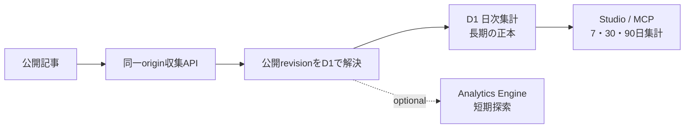

# 読者行動分析基盤

Noemaの分析基盤は、PVを増やすための追跡ではなく、記事が理解と次の行動につながったかを判断するために使います。公開記事で発生した限定的なイベントを、公開revisionへ結び付けて記録します。

## Studioで確認する

Studioの主ナビゲーションから「分析」を開き、7日・30日・90日を切り替えます。CMSの`view`権限が必要です。同じ集計はStudio MCPの読み取り専用ツール`studio_get_analytics_summary`からも取得できます。

主要指標は次の5つです。

| 指標 | 計算 | 判断できること |
| --- | --- | --- |
| 50%到達率 | `article_50 / landing` | 流入時の約束と記事冒頭が合い、本文の半分まで進んだ割合 |
| 読了率 | `article_end / landing` | 記事へ到達した読者が本文末尾まで進んだ割合 |
| 次記事移動率 | `navigation_click / article_end` | 読了後にシリーズ次記事または関連記事へ進んだ割合 |
| アシスタント利用率 | `assistant_open / landing` | 記事表示に対して質問を始めた割合 |
| アシスタント成功率 | `assistant_success / assistant_open` | 質問開始に対して回答表示まで成功した割合 |

分母が0の率は0%ではなく「—」と表示します。イベントは認証された人間だけを厳密に数えるものではないため、課金、セキュリティ判断、唯一の事業KPIには使わず、期間比較と記事改善の方向を見る指標として扱います。

この画面が扱うのはNoema内の行動です。ページ閲覧の実利用環境とCore Web VitalsはCloudflare Web Analytics、検索表示回数・検索クリック・検索語句はGoogle Search Consoleを公開時に有効化して別に確認します。検索結果に表示された事実はサイト内イベントから推測できないため、両者を同じ数値として混ぜません。

## 収集するイベント

| イベント | 発生条件 |
| --- | --- |
| `landing` | 公開記事を表示したとき |
| `article_50` | 本文の50%位置まで表示したとき |
| `article_end` | 本文末尾まで表示したとき |
| `navigation_click` | シリーズ次記事または関連記事を選んだとき |
| `share` | 共有URLのclipboard保存に成功したとき |
| `assistant_open` | モバイルの質問画面を開くか、デスクトップの質問欄を操作したとき |
| `assistant_success` | アシスタント回答の表示に成功したとき |
| `assistant_error` | アシスタント回答に失敗したとき |

同じページ表示では、同じ種類と対象のイベントを1回だけ送ります。サーバーはクライアントのrevision指定を受け取らず、受信時点でそのslugに紐づく公開revisionをD1から解決します。

## 保存先と保持境界

- D1の`cms_analytics_daily`にはUTC日付、記事ID、公開slug、公開revision番号、イベント種別、件数、限定した流入識別子だけを集約保存します。生のリクエストや読者単位の行は残さず、Studioの最長表示範囲に合わせて直近90日を保持します。
- Analytics Engineは任意の短期探索層です。Cloudflare accountで有効化し`READER_ANALYTICS`をbindingした環境だけ、`noema_reader_events`へ同じイベントを送ります。blob 1〜10はイベント、slug、revision、source、medium、campaign、content、referrer host、遷移種別、遷移先slug、double 1は件数、indexは不変の記事IDです。bindingがない環境でもD1の正本とStudio/MCPの分析は動作します。
- ブラウザの`sessionStorage`には流入識別子と30分の有効期限だけを保存します。永続的な読者IDやセッションIDは作りません。

質問本文、回答本文、会話履歴、APIキー、メールアドレス、IPアドレス、User-Agent、永続的な利用者IDは分析データへ保存しません。IPアドレスは乱用防止のためCloudflare edgeのRate Limitingキーとして一時利用しますが、D1、Analytics Engine、アプリケーションログには保存しません。UTMのsource・medium・campaign・contentは小文字英数字と`.`、`_`、`-`だけに制限します。キャンペーン名へ個人情報を入れてはいけません。

## 運用上の注意

- `landing`はブラウザ内のページ表示であり、厳密なユニークユーザー数ではありません。
- 同一originヘッダー、JSON形式、4 KiB上限、固定schemaを収集APIで検査し、1 IPあたり毎分120イベントに制限します。未知のslugと受理したslugはどちらも204を返し、unlisted記事の存在を応答から推測できないようにします。これらは品質上の境界であり、botを完全に排除する認証ではありません。
- D1書き込みを正本とし、Analytics Engineのbindingがなくても収集APIは成功として扱います。bindingがある環境で探索用送信だけが失敗した場合も、D1書き込みは成功したまま構造化ログ`blog.analytics.exploratory_write_failed`へ残します。
- 日次集計はUTCで区切ります。画面の対象期間より未来の日付は集計に含めません。
- schema変更は新しいD1 migrationで行い、既存migrationを書き換えません。
