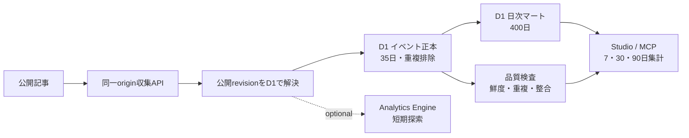

# 読者行動分析基盤

Noemaの分析基盤は、PVを増やすための追跡ではなく、記事が理解と次の行動につながったかを判断するために使います。公開記事で発生した限定的なイベントを、公開revisionへ結び付けて記録します。

## Studioで確認する

Studioの主ナビゲーションから「分析」を開き、7日・30日・90日を切り替えます。CMSの`view`権限が必要です。同じ集計はStudio MCPの読み取り専用ツール`studio_get_analytics_summary`からも取得できます。

主要指標は次の5つです。定義の正本は`@noema/cms`の`cmsAnalyticsMetricCatalog`です。画面、API、運用資料で分子・分母を独自に再定義しません。

| 指標ID | 計算 | 粒度 | 判断できること |
| --- | --- | --- | --- |
| `article_50_rate` | `article_50 / landing` | 公開記事revision | 流入時の約束と記事前半の構成を見直す |
| `qualified_read_rate` | `article_end / landing` | 公開記事revision | 記事の長さ、構成、説明の途切れを見直す |
| `onward_rate` | `navigation_click / article_end` | 公開記事revision | シリーズ導線と記事末尾CTAを見直す |
| `assistant_use_rate` | `assistant_open / landing` | 公開記事revision | アシスタントの発見性と必要性を見直す |
| `assistant_success_rate` | `assistant_success / assistant_open` | 公開記事revision | アシスタント実行経路の失敗を調べる |

分母が0の率は0%ではなく「—」と表示します。イベントは認証された人間だけを厳密に数えるものではないため、課金、セキュリティ判断、唯一の事業KPIには使わず、期間比較と記事改善の方向を見る指標として扱います。

この画面が扱うのはNoema内の行動です。ページ閲覧の実利用環境とCore Web VitalsはCloudflare Web Analytics、検索表示回数・検索クリック・検索語句はGoogle Search Consoleを公開時に有効化して別に確認します。検索結果に表示された事実はサイト内イベントから推測できないため、両者を同じ数値として混ぜません。

## 収集するイベント

| イベント | 発生条件 |
| --- | --- |
| `landing` | 公開記事を表示したとき |
| `article_50` | 本文の50%位置まで表示したとき |
| `article_end` | 本文末尾まで表示したとき |
| `navigation_click` | シリーズ次記事または関連記事を選んだとき |
| `share` | 共有URLのclipboard保存に成功したとき |
| `assistant_open` | モバイルの質問画面を開くか、デスクトップの質問欄を操作したとき |
| `assistant_success` | アシスタント回答の表示に成功したとき |
| `assistant_error` | アシスタント回答に失敗したとき |

同じページ表示では、同じ種類と対象のイベントを1回だけ送ります。サーバーはクライアントのrevision指定を受け取らず、受信時点でそのslugに紐づく公開revisionをD1から解決します。

イベント契約v1には、イベントごとに独立したUUIDの`eventId`、`schemaVersion: 1`、クライアント上の`occurredAt`を含めます。`eventId`は再送の重複排除だけに使い、別イベントや別ページを結合できる読者ID・セッションIDではありません。集計日は端末時計ではなく、サーバーの`receivedAt`から決めます。

## 保存先と保持境界

- D1の`cms_analytics_events`が短期の正本です。契約バージョン、イベントID、発生・受信時刻、公開revision、イベント種別、限定した流入・遷移次元を保存し、35日保持します。HTTPリクエスト全体や読者単位の識別子は保存しません。
- `cms_analytics_daily`は表示用マートです。イベント正本へのINSERTと同じDBトランザクション内のtriggerでUTC日次へ加算し、400日保持します。短期正本が残る範囲は再集計でき、長期傾向は日次マートで保持します。
- `cms_analytics_ingestion_daily`は受理件数と重複除外件数を保持します。`cms_analytics_pipeline_state`は完全な正本のcoverage開始日を示し、移行前の集計を再処理可能と誤認しないために使います。
- Analytics Engineは任意の短期探索層です。Cloudflare accountで有効化し`READER_ANALYTICS`をbindingした環境だけ、`noema_reader_events`へ同じイベントを送ります。blob 1〜10はイベント、slug、revision、source、medium、campaign、content、referrer host、遷移種別、遷移先slug、double 1は件数、indexは不変の記事IDです。bindingがない環境でもD1の正本とStudio/MCPの分析は動作します。
- ブラウザの`sessionStorage`には流入識別子と30分の有効期限だけを保存します。永続的な読者IDや、イベント間を結合するセッションIDは作りません。

## データ品質とlineage

Studioと`studio_get_analytics_summary`は、分析値と同時に次の運用状態を返します。

| 検査 | 判定 |
| --- | --- |
| 収集鮮度 | 最新イベント受信から24時間以内か。ただし低トラフィック時はサイト稼働状況と併せて判断する |
| 重複排除 | 受理・重複試行に占める重複が5%以下か |
| イベント契約 | schema v1、時刻形式、端末時刻と受信時刻の24時間以内の差を満たすか |
| revision lineage | 全イベントをCMSの公開revisionへ解決できるか |
| 正本・マート整合 | 完全coverage期間のイベント行数と日次マート合計が一致するか |
| 指標整合 | `article_50 <= landing`など主要率の分子が分母以下か |

値がない場合と0は区別します。正本coverage前の期間は「正常」ではなく「未評価」とします。警告はデータを自動補正せず、bot、欠測、期間境界、収集障害の調査開始条件として扱います。

「正本・マート整合」が不一致の場合、adminはStudioの「正本から再集計」またはMCPの`studio_rebuild_analytics_mart`を使えます。対象は完全な正本coverage開始日と35日の保持期限のうち遅い日以降、かつ連続35日以内に限定し、削除と再投影をD1 batchで原子的に実行します。実行範囲、正本件数、実行者、時刻は`cms_analytics_pipeline_runs`へ記録します。

Noema内のlineageは`公開記事 -> 同一origin API -> cms_analytics_events -> cms_analytics_daily -> Studio/MCP`です。Cloudflare Web AnalyticsとGoogle Search Consoleは別の正本を持つ外部sourceです。接続していない段階でNoemaの行動イベントから検索表示、検索クリック、Core Web Vitalsを推定しません。

質問本文、回答本文、会話履歴、APIキー、メールアドレス、IPアドレス、User-Agent、永続的な利用者IDは分析データへ保存しません。IPアドレスは乱用防止のためCloudflare edgeのRate Limitingキーとして一時利用しますが、D1、Analytics Engine、アプリケーションログには保存しません。UTMのsource・medium・campaign・contentは小文字英数字と`.`、`_`、`-`だけに制限します。キャンペーン名へ個人情報を入れてはいけません。

## 運用上の注意

- `landing`はブラウザ内のページ表示であり、厳密なユニークユーザー数ではありません。
- 同一originヘッダー、JSON形式、4 KiB上限、固定schemaを収集APIで検査し、1 IPあたり毎分120イベントに制限します。未知のslugと受理したslugはどちらも204を返し、unlisted記事の存在を応答から推測できないようにします。これらは品質上の境界であり、botを完全に排除する認証ではありません。
- D1イベント正本への書き込みを正本とし、Analytics Engineのbindingがなくても収集APIは成功として扱います。bindingがある環境で探索用送信だけが失敗した場合も、D1書き込みは成功したまま構造化ログ`blog.analytics.exploratory_write_failed`へ残します。
- 日次集計はUTCで区切ります。画面の対象期間より未来の日付は集計に含めません。
- schema変更は新しいD1 migrationで行い、既存migrationを書き換えません。
