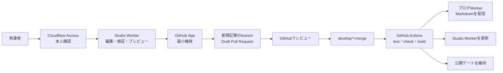

# Studio・ブログ接続ガイド

この文書は、Noema Studioで書いた記事がどのようにGitHubを経由してブログへ反映されるかと、各URL・Cloudflareサービスの役割をまとめた運用ガイドです。

## まず使うURL

| 用途 | URL | 現在の状態 |
| --- | --- | --- |
| 執筆Studio | <https://studio.noema-learn.uk> | Cloudflare Accessで執筆者だけに公開 |
| 開発ブログ | <https://noema-learn.mani1261790.workers.dev> | `develop`の最新デプロイを確認するURL |
| 公開予定サイト | <https://noema-learn.uk> | 公開承認まで公開ゲートが404を返す |

旧Studio URLの `https://noema-studio.mani1261790.workers.dev` は使用しません。Studio Workerでは`workers.dev`とpreview URLを無効化しているため、開くと「There is nothing here yet」などのCloudflareの汎用画面が表示されます。これはデプロイ失敗ではなく、認証を迂回できる旧入口を閉じた結果です。

## 全体の接続関係

Studioとブログは、ブラウザやAPIで直接記事を受け渡しません。記事の正はGit repository内のMarkdownです。Studioは新規記事をDraft Pull Requestとして提案し、レビュー後に`develop`へマージされると、GitHub ActionsがrepositoryのMarkdownからブログをbuildしてデプロイします。

この境界により、記事の差分、レビュー履歴、公開前検証、ロールバック元をGitHubに残せます。

## 記事が反映されるまで

1. <https://studio.noema-learn.uk>を開き、Cloudflare Accessで認証します。
2. Studioでfrontmatterと本文を編集し、プレビューと検証結果を確認します。
3. 「レビューを依頼」から新規記事を送信します。
4. Studio WorkerがAccess JWT、リクエスト元origin、記事schemaを検証します。
5. GitHub Appが新しいsubmission branchと、`develop`向けDraft Pull Requestを作成します。
6. GitHubで内容とCIを確認し、必要なら修正してから`develop`へマージします。
7. `develop`へのpushを契機にGitHub Actionsがtest、check、buildを行い、公開ゲート、ブログ、Studioの順にデプロイします。
8. 開発ブログURLで反映を確認します。`noema-learn.uk`は一般公開の承認までは404のままです。

現在、Studio APIから送信できるのは新規記事だけです。既存記事はStudioで読み込み・編集・Markdown書き出しができますが、API経由では更新しません。

## 各コンポーネントの責務

### Cloudflare Access

`studio.noema-learn.uk`への入口を執筆者限定にします。Studio WorkerもAccess JWTの署名、issuer、audience、有効期間を検証するため、入口とアプリケーションの二段階で保護します。

### Studio Worker

React/Viteの執筆画面と`/api/*`を同じWorkerで配信します。固定origin以外の変更リクエストを拒否し、GitHub Appの設定が揃った場合だけレビュー依頼を有効にします。`develop`への直接書き込み、既存branchの更新、force update、自動マージは行いません。

### GitHub AppとDraft Pull Request

GitHub AppはNoema repositoryだけに導入し、記事branchとDraft Pull Requestを作るための最小権限で動作します。Pull RequestがStudioと公開ブログの間のレビュー境界です。

### ブログWorker

`vnext/apps/blog/src/content/articles`のMarkdownをbuild時に読み込み、安全性と記事間リンクを検証して配信します。Studioの下書き保存領域やDurable Objectを直接参照しません。

### 公開ゲート

`noema-learn.uk/*`を受け、一般公開前は404、`Cache-Control: no-store`、`X-Robots-Tag: noindex`を返します。ブログWorkerはまだ本番domainのrouteを持たず、開発確認は`workers.dev` URLで行います。

## 設定の正

| 設定 | Source of truth | 役割 |
| --- | --- | --- |
| Studio custom domain・Access値・固定origin | `vnext/apps/studio/wrangler.jsonc` | Studioの唯一の公開入口とWorker側検証 |
| ブログのWorkers設定 | `vnext/apps/blog/wrangler.jsonc` | 開発ブログWorkerの配信 |
| 公開ゲートroute | `vnext/apps/public-gate/wrangler.jsonc` | 一般公開前のdomain閉鎖 |
| 自動デプロイ | `.github/workflows/deploy-development.yml` | `develop`限定の検証・3 Workerデプロイ |
| 記事 | `vnext/apps/blog/src/content/articles/**/*.md` | 公開コンテンツの正 |

Cloudflare Dashboardだけで値を変えるとrepositoryの設定とずれるため、review可能な設定はコード側を正とします。秘密鍵やtokenはrepositoryへ置かず、Cloudflare Worker secretまたはGitHub Actions secretで管理します。

## トラブルシューティング

### 「There is nothing here yet」と表示される

URLを確認してください。`noema-studio.mani1261790.workers.dev`は閉鎖済みです。<https://studio.noema-learn.uk>を使用します。

### Studioを開くとログイン画面になる

正常です。Cloudflare Accessの許可対象で認証するとStudioへ進みます。許可対象外のidentityでは利用できません。

### 「レビューを依頼」が使えない

Studioの連携状態表示を確認します。Access認証、GitHub Appの3 secret、GitHub Appのrepository installationが揃わない場合、Workerはfail-closedでGitHubへの書き込みを無効にします。

### PRをマージしたのにブログへ出ない

次を順に確認します。

1. Pull Requestのbaseが`develop`で、実際にmerge済みか
2. Actionsの`Deploy Noema development preview to Cloudflare`が成功したか
3. 記事の公開状態が公開対象になっているか
4. 確認先が開発ブログURLか（`noema-learn.uk`はまだ404が正常）

デプロイ手順、確認コマンド、rollbackは[開発環境デプロイ](./development-deployment.md)を参照してください。

## Studio URLを変更した理由

旧`workers.dev` URLは、Cloudflare Accessで保護したcustom domainとは別の公開入口になり得ます。custom domainだけを有効にして旧入口とpreview URLを無効化することで、必ずCloudflare Accessを通り、Worker側でも期待するaudienceとoriginを検証できる構成にしました。

つまり、URL変更の目的は見た目や命名ではなく、Studioの認証を迂回できる経路を残さないことです。
