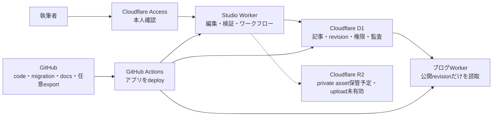

# Studio・CMS・ブログ接続ガイド

この文書は、Noema Studioで記事を作成し、複数人でレビューしてブログへ公開するまでの流れと、Cloudflare D1、R2、Access、GitHubの役割をまとめた運用ガイドです。

## まず使うURL

| 用途 | URL | 現在の状態 |
| --- | --- | --- |
| 執筆Studio | <https://studio.noema-learn.uk> | Cloudflare AccessとCMSメンバー登録の両方で保護 |
| 開発ブログ | <https://noema-learn.mani1261790.workers.dev> | CMSで公開した記事を確認するURL |
| 公開予定サイト | <https://noema-learn.uk> | 公開承認まで公開ゲートが404を返す |

旧Studio URLの `https://noema-studio.mani1261790.workers.dev` は使用しません。Studio Workerでは`workers.dev`とpreview URLを無効化しているため、開くと「There is nothing here yet」などのCloudflareの汎用画面が表示されます。これはデプロイ失敗ではなく、認証を迂回できる旧入口を閉じた結果です。

## 30秒で分かる仕組み

記事の正本はCloudflare D1です。Studioで保存、レビュー依頼、承認、公開を行うと、ブログWorkerはD1の公開revisionを実行時に読み取ります。記事を公開するためにGitHub Pull Requestを作成したり、アプリを再デプロイしたりする必要はありません。

GitHubはアプリケーションコード、D1 migration、運用文書、必要に応じた記事exportのbackupを管理します。ブラウザの`localStorage`は通信障害や保存競合から入力内容を救うための復旧コピーであり、共有・レビュー・公開の正本ではありません。

## 記事が反映されるまで

1. <https://studio.noema-learn.uk>を開き、Cloudflare Accessで認証します。
2. CMSへ招待済みのメンバーとしてStudioを開きます。最初の管理者だけは設定済みbootstrap emailから登録されます。
3. 新しい記事を作成するか、記事一覧から既存記事を選びます。
4. frontmatter、本文、公開範囲を編集し、プレビューと検証結果を確認します。
5. 「CMSに保存」でD1へ新しいimmutable revisionを保存します。保存後は約1.2秒の自動保存も動作します。
6. 編集者またはレビュー担当が「レビューを依頼」します。
7. レビュー担当または管理者が、修正依頼か承認を行います。自分が保存した最新版をレビュー担当自身が承認することはできません。
8. 管理者が承認済みrevisionを公開します。
9. 開発ブログURLで反映を確認します。`noema-learn.uk`は一般公開の承認までは404のままです。

公開中の記事を編集すると、新しいcurrent revisionが作られますが、読者へ配信するpublished revisionは変わりません。編集内容は、もう一度レビュー、承認、公開を行った時点で初めて読者へ反映されます。

## 権限

Cloudflare Accessを通過しただけではCMSを操作できません。Access identityのemailがCMSへ招待され、初回アクセス時にそのidentityとroleが結び付いた場合だけ利用できます。

| role | できること |
| --- | --- |
| 管理者 | 記事の作成・編集、レビュー、メンバー管理、公開、保管 |
| 編集者 | 記事の作成・編集・保存、レビュー依頼 |
| レビュー担当 | 記事の作成・編集・保存、レビュー依頼、承認、修正依頼 |

レビュー担当は、自分が保存した最新revisionを自己承認できません。管理者には初期運用や障害対応のためのoverride権限があります。無効化されたメンバーや未招待のidentityは、Accessを通過してもCMS APIを利用できません。

## レビュー状態と公開状態

レビュー状態と公開状態は別々に管理します。

| 種類 | 状態 | 意味 |
| --- | --- | --- |
| レビュー | 下書き | 編集中で、まだレビューを依頼していない |
| レビュー | レビュー待ち | レビュー担当の判断待ち |
| レビュー | 要修正 | コメントを反映して再依頼する状態 |
| レビュー | 承認済み | 現在のrevisionが公開可能 |
| 公開 | 未公開 | ブログから配信しない |
| 公開 | 公開中 | 指定した公開範囲でpublished revisionを配信 |
| 公開 | 保管 | ブログから外した状態 |

承認後に本文やfrontmatterを変更すると、承認済みrevisionとcurrent revisionが一致しなくなるため、その変更をそのまま公開できません。再レビューが必要です。

## 公開範囲

| 公開範囲 | 一覧・検索・テーマ・RSS・sitemap | 記事URL | 現在の扱い |
| --- | --- | --- | --- |
| 一般公開 | 表示する | 表示する | 利用可能 |
| 限定URL | 表示しない | URLを知る人へ表示 | 利用可能。ただし認証ではない |
| 指定メンバー | 表示しない | 読者認証後だけ表示する予定 | 読者認証が未接続のため公開不可 |
| 運営メンバーのみ | 表示しない | 公開ブログでは表示しない | Studio内の原稿管理用 |

限定URLはslugを知る人なら閲覧できます。秘密情報や個人情報のアクセス制御には使用しません。指定メンバー公開はD1に対象メンバーを保存する土台だけがあり、読者側の認証が未実装なので、現在のCMSは公開操作を拒否します。

## 保存競合

記事更新と状態変更には、取得時のversionを`ETag`と`If-Match`で照合するoptimistic lockを使います。別の編集者が先に保存した場合、古い画面からの更新は`412 revision_conflict`となり、後勝ちで上書きしません。

Studioは競合時も入力中の内容とブラウザの復旧コピーを保持します。Markdownを書き出して退避するか、入力内容を破棄してCMSの最新版を読み込むかを明示的に選びます。

## 各コンポーネントの責務

### Cloudflare Access

`studio.noema-learn.uk`への入口を執筆者限定にします。Studio WorkerもAccess JWTの署名、issuer、audience、有効期間を検証するため、入口とアプリケーションの二段階で保護します。CMSのroleはAccess policyとは別にD1で管理します。

### Studio Worker

React/Viteの執筆画面と`/api/cms/*`を同じWorkerで配信します。固定origin以外の変更リクエストを拒否し、Access identity、CMS role、入力schema、request size、`If-Match`をserver側で検証します。

### Cloudflare D1

記事、immutable revision、current・approved・published revisionのpointer、review状態、publication状態、公開範囲、メンバー、招待、監査eventを保存します。D1 database名は`noema-cms`、Worker binding名は`CMS_DB`です。

### ブログWorker

D1のpublished revisionだけを読み取ります。一般公開記事だけを一覧、検索、テーマ、RSS、sitemapへ出し、限定URL記事は直接URLからだけ配信します。下書き、要修正、承認のみで未公開の記事、保管記事、指定メンバー記事、運営メンバー限定記事は公開面へ出しません。記事アシスタントも同じ公開判定を通過した記事だけをcontextにします。

### Cloudflare R2

記事画像等のbinary assetをprivate bucketへ保存する予定です。現時点ではCloudflare accountでR2が有効化されていないため、Studioから画像をuploadできません。画像pathを手入力する既存欄はありますが、R2 upload済みという意味ではありません。

R2を有効化する場合も`r2.dev`を公開せず、Studio Workerが認証済みuploadを受け、ブログWorkerがD1の公開metadataを確認して配信する構成にします。R2のaccount有効化やbillingに関わる操作は自動化しません。

### GitHubとGitHub Actions

GitHubはcode、D1 migration、docsをreviewする場所です。`develop`へmergeするとGitHub Actionsが検証、D1 migration、Worker deploymentを行います。記事の編集・レビュー・公開はCMS内で完結し、通常はGitHubへ記事PRを作りません。

旧GitHub Appによるcreate-only Draft PR endpointと関連contractは移行期間中のlegacy実装です。CMSの運用確認が完了するまで削除せず保持しますが、現行の記事管理フローやsource of truthとしては使用しません。

### 公開ゲート

`noema-learn.uk/*`を受け、一般公開前は404、`Cache-Control: no-store`、`X-Robots-Tag: noindex`を返します。ブログWorkerはまだ本番domainのrouteを持たず、開発確認は`workers.dev` URLで行います。CMSで記事を一般公開にしても、公開ゲートを外すまでは`noema-learn.uk`から閲覧できません。

## 設定の正

| 設定・データ | Source of truth | 役割 |
| --- | --- | --- |
| 記事、revision、権限、review、公開範囲 | Cloudflare D1 `noema-cms` | CMSとブログが共有する記事の正本 |
| D1 schema | `vnext/apps/studio/migrations` | 順序付きmigration |
| CMS contract | `vnext/packages/cms` | role、状態、request/response schema |
| Studio custom domain・Access値・固定origin | `vnext/apps/studio/wrangler.jsonc` | Studioの唯一の公開入口とWorker側検証 |
| ブログのD1 bindingとWorkers設定 | `vnext/apps/blog/wrangler.jsonc` | 公開revisionの読取と配信 |
| 公開ゲートroute | `vnext/apps/public-gate/wrangler.jsonc` | 一般公開前のdomain閉鎖 |
| 自動デプロイ | `.github/workflows/deploy-development.yml` | `develop`限定の検証・migration・3 Workerデプロイ |
| binary asset | Cloudflare R2 | 未有効。private bucketで導入予定 |
| code・migration・docs・必要に応じてD1から書き出したbackup | GitHub | review可能な変更履歴 |
| ブラウザ保存 | `localStorage` | 入力内容の復旧コピーだけ |

Cloudflare DashboardだけでbindingやAccess値を変えるとrepositoryの設定とずれるため、review可能な設定はコード側を正とします。秘密鍵やtokenはrepositoryへ置かず、Cloudflare Worker secretまたはGitHub Actions secretで管理します。

## トラブルシューティング

### 「There is nothing here yet」と表示される

URLを確認してください。`noema-studio.mani1261790.workers.dev`は閉鎖済みです。<https://studio.noema-learn.uk>を使用します。

### Studioを開くとログイン画面になる

正常です。Cloudflare Accessの許可対象で認証するとStudioへ進みます。Accessを通過後に「招待されていません」と出る場合は、CMS管理者へメンバー登録を依頼します。

### CMSを利用できない

Access認証、D1 binding、D1 migration、CMSメンバー登録を順に確認します。`no such table`が記録されている場合は、Workerを再deployする前に未適用のD1 migrationを確認します。

### 保存競合と表示される

別のメンバーが先に記事を更新しています。入力内容は保持されているため、必要ならMarkdownを書き出してから「CMSの最新版を読み込む」を選びます。自動上書きは行いません。

### 公開したのにブログへ出ない

次を順に確認します。

1. review状態が承認済みで、管理者が公開操作まで完了したか
2. 一覧へ出したい記事の公開範囲が一般公開か
3. publication状態が公開中か
4. 確認先が開発ブログURLか（`noema-learn.uk`はまだ404が正常）
5. ブログWorkerに`CMS_DB`がbindされ、最新versionがdeploy済みか

記事公開そのものではGitHub Actionsを実行しません。アプリケーションcodeやschemaを変更した場合だけ、Actionsの`Deploy Noema development preview to Cloudflare`を確認します。

### 画像をuploadできない

現在はR2がaccountで未有効なので正常です。Wrangler loginやGitHub secretだけでは解消しません。R2のaccount有効化を明示的に行い、private bucket、asset metadata、認証済みupload、公開時の読取境界を実装した後に利用可能になります。

デプロイ手順、migration、確認コマンド、rollbackは[開発環境デプロイ](./development-deployment.md)を参照してください。

## Studio URLを変更した理由

旧`workers.dev` URLは、Cloudflare Accessで保護したcustom domainとは別の公開入口になり得ます。custom domainだけを有効にして旧入口とpreview URLを無効化することで、必ずCloudflare Accessを通り、Worker側でも期待するaudienceとoriginを検証できる構成にしました。

つまり、URL変更の目的は見た目や命名ではなく、Studioの認証を迂回できる経路を残さないことです。
