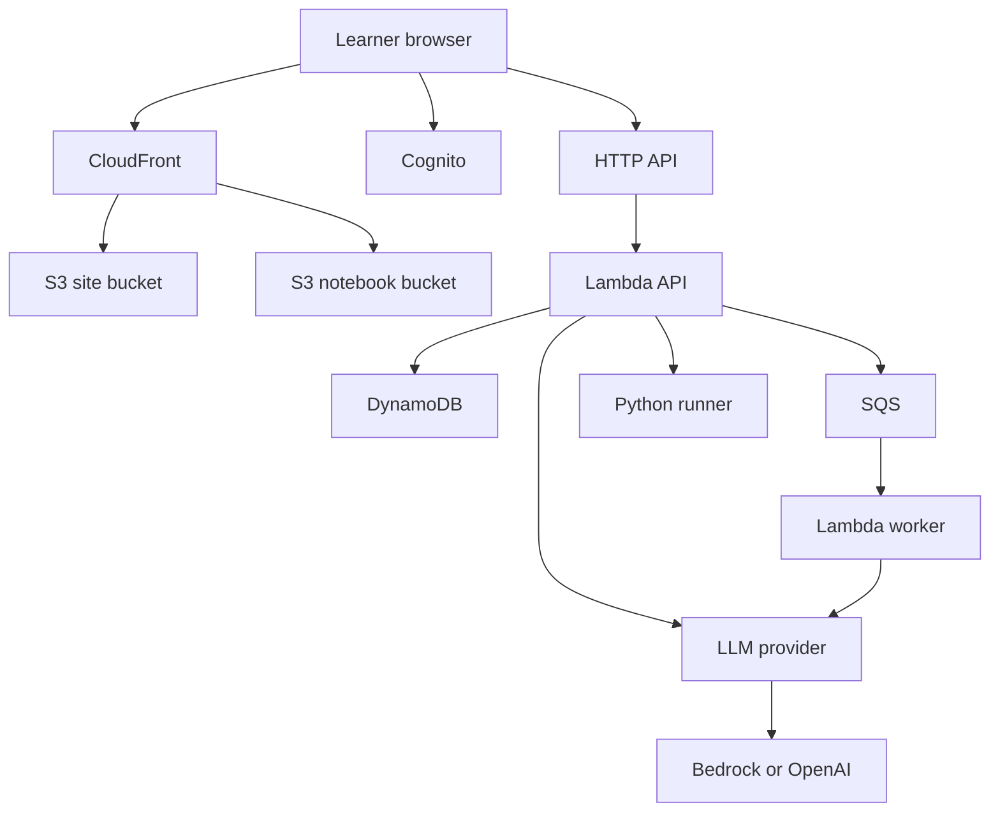
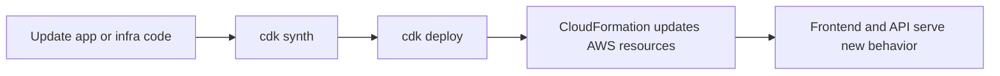

# Noema Infra

This directory contains the AWS CDK stack for Noema.

The stack is intentionally biased toward low fixed cost:

- serverless compute
- pay-per-request databases and queues
- optional monitoring features
- low-cost defaults for retention, versioning, and backups

## Infrastructure Flow



## Cost Profile

By default, the stack now avoids several always-on extras:

- DynamoDB point-in-time recovery: disabled
- S3 bucket versioning: disabled
- access-log DynamoDB writes: disabled
- CloudWatch alarms and dashboard: disabled
- SNS alarm topic: disabled
- Lambda log retention: 7 days

Enable those only when you need stronger ops visibility or rollback protection.

## Typical Deploy Flow



## Minimal Commands

```bash
cd infra
npm install

export AWS_PROFILE=noema-prod
export AWS_REGION=ap-northeast-3

npm run synth
npm run deploy -- --require-approval never -c frontendUrl=https://your-frontend-domain
```

## Optional Flags

Turn operational features back on only when needed:

```bash
npm run deploy -- --require-approval never \
  -c frontendUrl=https://your-frontend-domain \
  -c enableOperationalMonitoring=true \
  -c enablePointInTimeRecovery=true \
  -c enableBucketVersioning=true \
  -c enableAccessLogs=true
```

Useful extra flags:

- `-c qaModelProvider=bedrock`
- `-c qaModelProvider=openai`
- `-c createGithubDeployRole=true`
- `-c cognitoDomainPrefix=...`

## Notes

- Current production depends on Cognito, API Gateway, Lambda, DynamoDB, S3, CloudFront, and SQS.
- Monitoring and audit-heavy features are optional.
- If you only need the app to run cheaply, leave the optional flags off.
