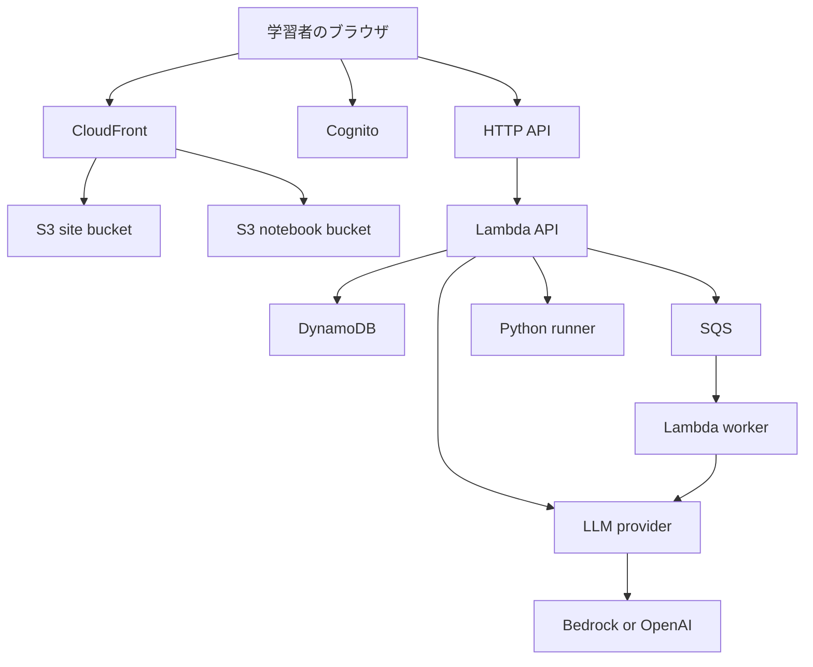
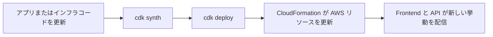

# Noema Infra

このディレクトリには、Noema の AWS CDK スタックがあります。

このスタックは、固定費を低く抑えることを意図して設計しています。

- サーバーレスコンピュート
- リクエスト課金のデータベースとキュー
- 任意で有効化する監視機能
- 保存期間、バージョニング、バックアップの低コスト既定値

## インフラ構成


```mermaid
flowchart TD
  A["学習者のブラウザ"] --> B["CloudFront"]
  B --> C["S3 site bucket"]
  B --> D["S3 notebook bucket"]
  A --> E["Cognito"]
  A --> F["HTTP API"]
  F --> G["Lambda API"]
  G --> H["DynamoDB"]
  G --> I["SQS"]
  I --> J["Lambda worker"]
  G --> K["Python runner"]
  G --> L["LLM provider"]
  J --> L
  L --> M["Bedrock or OpenAI"]
```

## コスト方針

既定では、常時コストがかかりやすい機能を避けます。

- DynamoDB point-in-time recovery: 無効
- S3 bucket versioning: 無効
- access-log DynamoDB writes: 無効
- CloudWatch alarms and dashboard: 無効
- SNS alarm topic: 無効
- Lambda log retention: 7日

運用可視性やロールバック保護を強める必要がある場合だけ有効化します。

## 典型的なデプロイの流れ


```mermaid
flowchart LR
  A["アプリまたはインフラコードを更新"] --> B["cdk synth"]
  B --> C["cdk deploy"]
  C --> D["CloudFormation が AWS リソースを更新"]
  D --> E["Frontend と API が新しい挙動を配信"]
```

## 最小コマンド

```bash
cd infra
npm install

export AWS_PROFILE=noema-prod
export AWS_REGION=ap-northeast-3

npm run synth
npm run deploy -- --require-approval never -c frontendUrl=https://your-frontend-domain
```

## 任意フラグ

運用機能は必要な場合だけ有効にします。

```bash
npm run deploy -- --require-approval never \
  -c frontendUrl=https://your-frontend-domain \
  -c enableOperationalMonitoring=true \
  -c enablePointInTimeRecovery=true \
  -c enableBucketVersioning=true \
  -c enableAccessLogs=true
```

よく使う追加フラグ:

- `-c qaModelProvider=bedrock`
- `-c qaModelProvider=openai`
- `-c createGithubDeployRole=true`
- `-c cognitoDomainPrefix=...`

## 注意点

- 現在の production は Cognito、API Gateway、Lambda、DynamoDB、S3、CloudFront、SQS に依存します。
- 監視や監査ログを厚くする機能は任意です。
- 低コストでアプリを動かすだけなら、任意フラグは無効のままにします。
