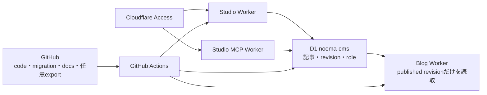

# Noemaアプリケーション

D1をsource of truthとするCMS型Markdown技術ブログの現行実装です。directory名の`vnext`は旧AWS版と並行開発していた時期の名残ですが、現在はこちらが唯一のNoema applicationです。

退役したNext.js/AWS版は [Noema AWS Archive](https://github.com/mani1261790/Noema-AWS-Archive) に保存しています。

## 必要環境

- Node.js 22.18以上
- npm
- Cloudflareへ手動deployする場合だけWrangler login

GitHub ActionsではNode.js 24とWrangler 4.110.0を使います。

## Workspace

- `apps/blog`: AstroとCloudflare adapterで構築するCMSブログと記事アシスタントAPI
- `apps/studio`: React/Viteで構築するCMS型Markdown StudioとWorker API
- `apps/studio-mcp`: Access保護された下書き専用remote MCP Worker
- `apps/public-gate`: `noema-learn.uk`を非公開に保つWorker
- `packages/cms`: role、review・publication状態、公開範囲、CMS API contract
- `packages/content`: 記事schema、Markdown validation、UI確認用fixture
- `packages/ui`: Noema共通styleとデジタル庁公式snippet由来CSS
- `design/concepts`: 実装照合用の画面concept
- `design/qa`: browser確認時のcapture

## CMSの接続

記事、immutable revision、メンバー権限、review状態、publication状態、公開範囲、監査eventの正本はCloudflare D1 `noema-cms`です。Studio Worker、Studio MCP Worker、Blog Workerは同じdatabaseを`CMS_DB`としてbindします。



Git repository内のMarkdownは公開記事のsource of truthではありません。`apps/blog/src/content/articles`はlegacy GitHub flowとpath validatorの互換用に残していますが、公開面はD1のpublished revisionを読み取ります。`packages/content`のfixtureと`/preview/article`もUI確認専用で、CMS記事や公開コンテンツには含めません。

Studioとブログの運用全体は [Studio・CMS・ブログ接続ガイド](../docs/studio-blog-connectivity.md) を参照してください。

## ローカル開発

依存関係をinstallします。

```bash
cd vnext
npm ci
```

### ブログとlocal D1

通常のcommandでBlogを起動します。

```bash
cd vnext
npm run dev:blog
```

Blog workspaceの`predev`が、Studioのmigration fileをlocal D1へ非対話で適用してからAstroを起動します。Cloudflare adapterは開発時にも有効なので、`cloudflare:workers`のlocal `CMS_DB` bindingをそのまま利用できます。

```bash
cd vnext/apps/blog
CI=true npx wrangler d1 migrations apply noema-cms \
  --local \
  --config ../studio/wrangler.jsonc \
  --persist-to .wrangler/state
```

Blogの既定URLは `http://localhost:4321` です。Local D1はremote `noema-cms`とは別で、local開発からremote記事を変更しません。

### Studio

画面だけを調整する場合はViteを起動します。

```bash
cd vnext
npm run dev:studio
```

既定URLは `http://localhost:4322` です。`dev:studio`はUI編集用で、Worker API、Access JWT、D1 binding、`.dev.vars`は読みません。

Workerのasset配信とlocal D1 bindingを確認する場合は、Studioのlocal D1へmigrationを適用してからproduction buildをWranglerで配信します。

```bash
cd vnext/apps/studio
npx wrangler d1 migrations apply noema-cms \
  --local \
  --config wrangler.jsonc
npm run dev:worker
```

Workerの既定URLは`http://localhost:8787`です。ローカルのmutation境界を確認する場合は、Git管理しない`.dev.vars`の`STUDIO_ALLOWED_ORIGIN`もこのoriginへ合わせます。ただしlocalhostではCloudflare Access edgeが`Cf-Access-Jwt-Assertion`を付与しないため、通常のbrowser操作でCMS APIにloginできるわけではありません。APIの認証・role・D1 mutationはlocal Worker test、Accessを含む統合flowはdeploy後の`studio.noema-learn.uk`で確認します。

### Studio MCP

Studio MCPは`https://mcp.noema-learn.uk/mcp`でStreamable HTTPを提供します。Cloudflare Access Managed OAuthと既存CMS member roleの両方を通過したidentityだけが利用できます。公開するのはidentity確認、記事一覧・取得、下書き検証・作成・更新で、レビュー依頼、承認、公開、保管、メンバー管理はStudio画面に残します。

ローカルではAccess edgeを迂回して実運用接続するのではなく、Worker testでprotocol、role、D1 mutation、再送のidempotencyを確認します。

```bash
cd vnext
npm test --workspace @noema/studio-mcp
npm run check --workspace @noema/studio-mcp
```

Cloudflare側の初期設定とclient接続は[Studio MCP接続・運用ガイド](../docs/studio-mcp.md)を参照してください。

## 記事contract

記事revisionはfrontmatter JSONとMarkdown本文をD1へ保存します。Frontmatterでは、話題を表す`topics`と、技術への触れ方を表す`approach`を独立して設定します。`approach`は`experience`、`practice`、`development`、`theory`の4種類で、開発と理論は並列です。加えて`outcome`、`prerequisites`を設定します。掲載方針の正は[コンテンツ・掲載方針](../docs/content-strategy.md)です。

Studioは入力途中で必須項目が欠けたdraftもD1へ保存できます。レビュー依頼時にstrictな記事schemaとMarkdown validatorを適用し、raw HTML、危険なURL scheme、H1、見出しレベルの飛び、画像alt、内部リンク形式を検査します。公開操作はその検証済みrevisionがcurrentかつapprovedであることを再確認します。Blocking errorから該当frontmatterまたは本文行へ移動できます。

Blog WorkerはD1のpublished revisionをruntimeでMarkdownからHTMLへ変換します。Rendererでもraw HTMLをescapeし、危険なlink・image URLを無効化するため、validatorだけをsecurity境界にしません。HTMLのコード例はインラインコードまたはコードフェンスへ記述してください。

公開記事はホーム、記事一覧、テーマ、RSS、sitemapへ自動反映されます。一般公開記事だけを一覧系surfaceへ出し、限定URL記事は直接URLからだけ表示して`noindex`にします。指定メンバー公開は読者認証が未接続のため現在は公開できず、運営メンバー限定記事はブログから取得できません。

## Studio CMS

Studioは最初に記事ライブラリを表示し、タイトル・スラッグ・更新者の検索と状態フィルターから既存記事を開けます。記事行の「編集する」から再編集し、編集画面の「記事一覧へ」で戻ります。新規記事は最初の明示的なCMS保存で作成し、既存記事は編集後約1.2秒で自動保存します。ブラウザの`localStorage`にも復旧コピーを保存します。CMS未保存の新規原稿は記事一覧と分離し、既存記事の復旧コピーは記事IDとlock versionを保持して再読込後も同じCMS記事へ再接続します。記事IDを持たない旧形式の復旧原稿は、元記事への引き継ぎか新規記事かを明示的に選ぶまでCMSへ保存しません。共有・レビュー・公開の正本はD1です。

記事revisionは保存ごとにD1へ不変のcheckpointとして残し、Studioの「版の履歴」では同じ編集セッションの自動保存を1版にまとめます。30分以上の中断、手動保存、競合解消、復元、workflow操作を版の境界にします。版内の自動保存も展開して任意の保存時点を選べます。過去版の復元は既存revisionやpublished revisionを動かさず、選択した内容を未保存の編集状態へ戻し、次の保存で復元元を記録した新しいrevisionを作ります。

CMS内部では変更されないUUIDで記事を識別し、公開URLには人が読めるスラッグを使用します。旧GitHub記事とUI確認用fixtureは記事ライブラリへ自動移行されません。詳しい再編集手順と移行境界は[Studio・CMS・ブログ接続ガイド](../docs/studio-blog-connectivity.md#保存済みの記事を再編集する)を参照してください。

画面幅にかかわらず、本文・プレビュー・設定をキーボード操作可能なタブで1ペインずつ表示します。本文を最初に置き、公開範囲、分類、画像、参考資料、管理操作は必要な時だけ開きます。保存、review状態、publication状態、公開中revision、公開範囲を色と文章で示します。入力と本文は16px以上、プレビュー本文は17pxとし、すべての主要タッチ対象を44px以上にします。

### Role

| role | 操作 |
| --- | --- |
| 管理者 | 編集、承認、メンバー管理、公開、保管 |
| 編集者 | 編集、保存、レビュー依頼 |
| レビュー担当 | 編集、保存、レビュー依頼、承認、修正依頼 |

レビュー担当は自分が保存した最新版を自己承認できません。Access identityはCMS invitationと照合し、未招待または無効なメンバーはCMS APIを利用できません。

### Revisionと競合

CMSはcurrent、approved、published revisionを別々に保持します。公開中の記事を編集してもpublished revisionは変わらず、current revisionを再レビュー、承認、公開した時だけ読者向け内容を切り替えます。

更新と状態変更には`ETag` / `If-Match`によるoptimistic lockを使います。別の編集者が先に保存した場合は`412 revision_conflict`で停止し、入力内容と復旧コピーを保持します。利用者はMarkdownを書き出すか、入力を破棄してCMSの最新版を読み込みます。後勝ちの自動上書きは行いません。

### CMS API

Studio Workerは`/api/*`を静的SPAより先に処理し、現行CMS APIを`/api/cms/*`で提供します。

- `GET /api/cms/session`: Access identity、CMS role、capability
- `GET /api/cms/articles`: 記事一覧
- `POST /api/cms/articles`: 新規記事とrevisionを作成
- `GET /api/cms/articles/{id}`: current revisionを取得
- `PUT /api/cms/articles/{id}`: `If-Match`付きで新revisionを保存
- `POST /api/cms/articles/{id}/actions`: レビュー依頼、承認、修正依頼、公開、保管、復元
- `GET /api/cms/members`: 管理者向けメンバー一覧
- `PUT /api/cms/members`: 管理者向け招待・role・有効状態の更新
- その他の`/api/*`: JSONの404を返し、StudioのHTMLへフォールバックしない

Mutationは固定Studio origin、検証済みAccess principal、CMS role、JSON media type、streaming byte上限、strict schemaをserver側で検証します。CMS responseは`private, no-store`です。

`wrangler.jsonc`の`ACCESS_TEAM_DOMAIN`、`ACCESS_POLICY_AUD`、`STUDIO_ALLOWED_ORIGIN`は、`studio.noema-learn.uk`を保護するCloudflare Access applicationと本人限定policyに対応するreview可能なproduction設定です。Studioはcustom domainだけで公開し、`workers.dev`とpreview URLを無効化します。

### Legacy GitHub publication


## R2画像

記事画像はprivate Cloudflare R2へ保存する設計ですが、現在はaccountでR2が有効化されていないためStudioからuploadできません。Frontmatterの画像path欄へ手入力できても、R2 upload済みという意味ではありません。

導入時はR2を直接公開せず、Studio WorkerがAccess認証とCMS roleを確認してuploadし、Blog WorkerがD1のpublished revisionとasset metadataを確認して配信します。R2の有効化、billing、bucket作成は通常deployで自動化しません。

## 記事アシスタント

読者自身のOpenAI API keyをrequest中だけ使います。

- API keyと会話を永続化しない
- OpenAI Responses APIへ`store: false`を指定する
- D1で公開判定を通過した表示中の記事だけをcontextにする
- 回答をStructured Outputsで検証し、根拠にした記事内見出しへのリンクを表示する

## 検証

```bash
cd vnext
npm test
npm run check
npm run build
npm run deploy:dry-run
```

`deploy:dry-run`はCloudflareへ認証・uploadせず、公開ゲート、ブログ、Studio、Studio MCPのWorker成果物とbindingを検証します。D1 repository testはmigrationをlocal Miniflareへ適用し、role、状態遷移、published revisionの固定、stale update時に孤立revisionを作らないことを検証します。

## Cloudflare開発環境

| 対象 | Worker / resource | URL・役割 |
| --- | --- | --- |
| ブログ | `noema-learn` | <https://noema-learn.mani1261790.workers.dev> |
| Studio | `noema-studio` | <https://studio.noema-learn.uk>（Cloudflare Access保護） |
| Studio MCP | `noema-studio-mcp` | <https://mcp.noema-learn.uk/mcp>（Access Managed OAuth保護） |
| 公開ゲート | `noema-public-gate` | <https://noema-learn.uk>（404） |
| CMS | D1 `noema-cms` | 記事とeditorial workflowの正本 |
| 画像 | R2 | account未有効 |

ブログは`workers.dev`で確認します。StudioとStudio MCPはcustom domainだけを公開し、`workers.dev`とpreview URLは利用できません。ブログWorkerは本番routeを持たず、`noema-learn.uk/*`は公開ゲートだけが受けます。

## 自動デプロイ

`.github/workflows/deploy-development.yml`が`develop`の最新versionをCloudflareへdeployします。

- `develop`へのpushだけがtrigger
- `main`、feature branch、Pull Requestはdeployしない
- 手動実行も`develop` refだけを許可
- GitHub Deployments / Environmentsは使わない
- repository secret `CLOUDFLARE_API_TOKEN`を使用
- test、check、build、公開ゲート、D1 migration、ブログ、Studio、Studio MCPの順
- 記事の保存・レビュー・公開だけではworkflowを実行しない

設定、確認、手動実行、rollbackの正は [開発環境デプロイ](../docs/development-deployment.md) を参照してください。

## デザイン資料

- `design/concepts`: 実装前の画面concept
- `design/qa`: 実browserで確認したcapture
- `DESIGN_CONFORMANCE.md`: デジタル庁デザインシステムとの対応表
